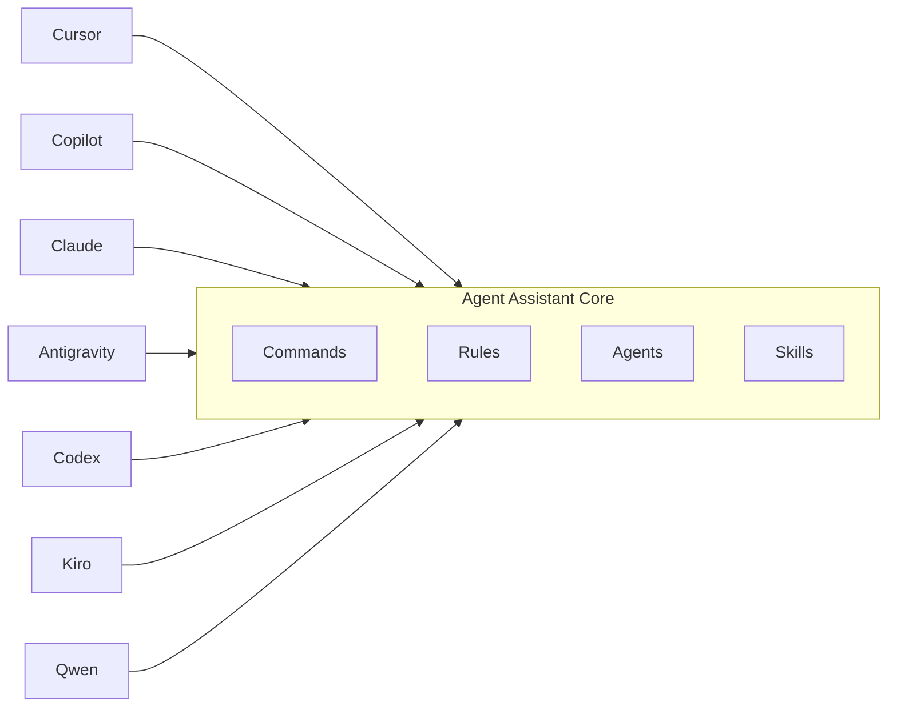

# System Overview

> **File**: `.documents/knowledge-architecture/01-system-overview.md`
> **Purpose**: High-level architecture diagram, style, and layer boundaries

---

## Architecture Style

Agent Assistant uses a **Tiered Orchestration Architecture** with five distinct layers:

1. **Command Layer** — Routes user intent to appropriate execution path
2. **Rule Layer** — Defines orchestration protocols and constraints
3. **Agent Layer** — Executes tasks through specialist agents
4. **Team Layer** — Coordinates multi-agent collaboration
5. **Skill Layer** — Injects domain knowledge on demand

---

## High-Level Architecture Diagram

```mermaid
graph TB
    subgraph USER["User Interface"]
        U[User Input]
    end

    subgraph CMD["Command Layer"]
        C14[/cook\]
        C15[/fix\]
        C16[/plan\]
        C17[/debug\]
        C18[/test\]
        C19[/review\]
        C20[/docs\]
        C21[/design\]
        C22[/deploy\]
        C23[/report\]
        C24[/wiki\]
        C25[/brainstorm\]
        C26[/ask\]
        C27[/code\]
        C28[/report\]
    end

    subgraph RULES["Rule Layer"]
        R1[CORE]
        R2[PHASES]
        R3[AGENTS]
        R4[SKILLS]
        R5[TEAMS]
        R6[ERRORS]
        R7[REFERENCE]
    end

    subgraph AGENTS["Agent Layer"]
        A1[backend-engineer]
        A2[frontend-engineer]
        A3[mobile-engineer]
        A4[game-engineer]
        A5[tech-lead]
        A6[database-architect]
        A7[tester]
        A8[reviewer]
        A9[debugger]
        A10[security-engineer]
        A11[performance-engineer]
        A12[wiki-reviewer]
        A13[planner]
        A14[brainstormer]
        A15[business-analyst]
        A16[designer]
        A17[devops-engineer]
        A18[docs-manager]
        A19[project-manager]
        A20[reporter]
        A21[researcher]
        A22[scouter]
        A23[wiki-architect]
        A24[wiki-extractor]
    end

    subgraph TEAMS["Team Layer"]
        T1[backend-team]
        T2[frontend-team]
        T3[fullstack-team]
        T4[database-team]
        T5[debug-team]
        T6[design-team]
        T7[devops-team]
        T8[docs-team]
        T9[game-team]
        T10[mobile-team]
        T11[performance-team]
        T12[planning-team]
        T13[project-team]
        T14[qa-team]
        T15[report-team]
        T16[research-team]
        T17[security-team]
        T18[wiki-team]
    end

    subgraph SKILLS["Skill Layer"]
        S1[foundation ~200]
        S2[professional ~400]
        S3[specialized ~500]
        S4[expert ~300]
    end

    U --> CMD
    CMD --> RULES
    RULES --> AGENTS
    AGENTS <--> TEAMS
    AGENTS --> SKILLS
    TEAMS --> SKILLS
```



---

## Layer Boundaries

### Layer 1: Command Layer

| Boundary | Description |
|----------|-------------|
| **Input** | User text commands (e.g., `/cook`, `/fix`) |
| **Output** | Routed command to Rule Layer |
| **Responsibility** | Parse intent, select variant, pass to rules |
| **Location** | `commands/` folder |

### Layer 2: Rule Layer

| Boundary | Description |
|----------|-------------|
| **Input** | Routed command with context |
| **Output** | Orchestration protocol |
| **Responsibility** | Define execution order, agent selection |
| **Location** | `rules/` folder |

### Layer 3: Agent Layer

| Boundary | Description |
|----------|-------------|
| **Input** | Task from Rule Layer |
| **Output** | Task result + skill injection |
| **Responsibility** | Execute specialized task |
| **Location** | `agents/` folder |

### Layer 4: Team Layer

| Boundary | Description |
|----------|-------------|
| **Input** | Complex task from Agent Layer |
| **Output** | Coordinated multi-agent result |
| **Responsibility** | Coordinate adversarial review |
| **Location** | `agents/teams/` folder |

### Layer 5: Skill Layer

| Boundary | Description |
|----------|-------------|
| **Input** | Agent context and task |
| **Output** | Relevant skills injected |
| **Responsibility** | Domain knowledge lookup |
| **Location** | `skills/`, `matrix-skills/` folders |

---

## Component Interaction

### Horizontal Communication

Commands flow downward through layers:

```
User → Command → Rules → Agent → Output
```

### Vertical Communication

Teams communicate across agent types:

```
Tech Lead ↔ Executor ↔ Reviewer
```

### Skill Injection

Skills inject horizontally into any layer:

```
Agent ← HSOL → Skills
```

---

## Multi-Platform Architecture

Agent Assistant abstracts platform differences:



### Platform Abstraction Benefits

| Benefit | Description |
|---------|-------------|
| **Portability** | Same commands work everywhere |
| **Consistency** | Unified experience |
| **Maintainability** | Single codebase |
| **Extensibility** | Easy to add platforms |

---

## Scalability Characteristics

| Metric | Current | Notes |
|--------|---------|-------|
| Agents | 24 | Specialist-based |
| Commands | 14 | Core + extended |
| Teams | 18 | Domain teams |
| Skills | 1400+ | Tiered by expertise |

---

## Evidence Sources

- `rules/CORE.md` — Core orchestration rules
- `rules/PHASES.md` — Phase definitions
- `commands/` — Command definitions
- `agents/` — Agent definitions
- `agents/teams/` — Team definitions
- `skills/` — Skill registry
- `matrix-skills/` — Skill tier definitions
