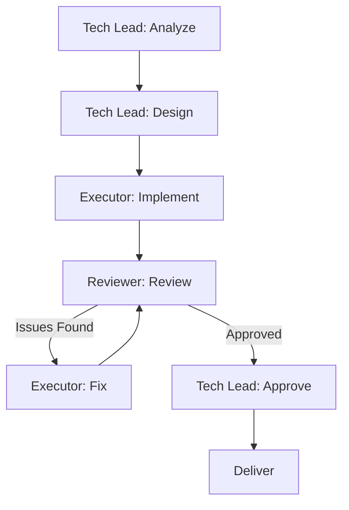
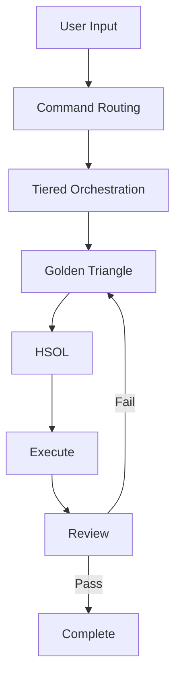

# Design Patterns

> **File**: `.documents/knowledge-architecture/04-design-patterns.md`
> **Purpose**: Core architectural patterns: Tiered Orchestration, Golden Triangle, HSOL, Command Routing

---

## Overview

Agent Assistant uses four core architectural patterns:

1. **Tiered Orchestration** — Layered command processing
2. **Golden Triangle** — Adversarial team coordination
3. **HSOL** — Hybrid Skill Orchestration Layer
4. **Command Routing** — Variant-based execution paths

---

## Pattern 1: Tiered Orchestration

### Problem

A single AI cannot effectively handle all development tasks without becoming a "jack of all trades, master of none."

### Solution

Split execution into specialized layers with clear responsibilities:

```
┌─────────────────────────────────────────┐
│  Layer 5: Skill Layer                  │
│  Domain knowledge injection              │
├─────────────────────────────────────────┤
│  Layer 4: Team Layer                    │
│  Multi-agent coordination                │
├─────────────────────────────────────────┤
│  Layer 3: Agent Layer                   │
│  Specialist task execution               │
├─────────────────────────────────────────┤
│  Layer 2: Rule Layer                    │
│  Orchestration protocols                 │
├─────────────────────────────────────────┤
│  Layer 1: Command Layer                 │
│  User intent parsing                     │
└─────────────────────────────────────────┘
```

### Benefits

| Benefit | Description |
|---------|-------------|
| **Separation of concerns** | Each layer has one job |
| **Scalability** | Add agents without restructuring |
| **Maintainability** | Changes isolated to one layer |
| **Testability** | Each layer independently testable |

### Implementation

| Layer | Implementation | Location |
|-------|----------------|----------|
| Commands | Markdown files | `commands/` |
| Rules | Markdown files | `rules/` |
| Agents | Markdown files | `agents/` |
| Teams | Markdown folders | `agents/teams/` |
| Skills | Markdown files | `skills/` |

---

## Pattern 2: Golden Triangle

### Problem

Code written by a single agent often has blind spots—design flaws, security issues, performance problems that the author cannot see.

### Solution

Create adversarial teams where each role provides oversight:

```
┌─────────────────────────────────────────────────────┐
│                    TECH LEAD                        │
│  - Requirements analysis                            │
│  - Architecture design                             │
│  - Technical decisions                              │
│  - Coordination                                     │
└─────────────────────────────────────────────────────┘
                         │
         ┌───────────────┴───────────────┐
         ▼                               ▼
┌─────────────────────────────────┐ ┌─────────────────────────────────┐
│           EXECUTOR               │ │           REVIEWER              │
│  - Implementation                │ │  - Adversarial review           │
│  - Code generation              │ │  - Security audit                │
│  - Feature development          │ │  - Performance review           │
│  - Testing                      │ │  - Best practices check         │
└─────────────────────────────────┘ └─────────────────────────────────┘
```

### Roles

| Role | Primary Responsibility | Secondary Responsibility |
|------|------------------------|------------------------|
| **Tech Lead** | Architecture | Coordination |
| **Executor** | Implementation | Testing |
| **Reviewer** | Quality assurance | Security |

### Workflow



### Quality Gates

| Gate | Reviewer Check | Pass Criteria |
|------|---------------|---------------|
| Security | OWASP Top 10 | No vulnerabilities |
| Performance | Load test | < 200ms response |
| Testing | Coverage | > 80% coverage |
| Style | Linting | No errors |

### Teams Using Golden Triangle

All 18 teams use this pattern:
- `backend-team`, `frontend-team`, `fullstack-team`
- `database-team`, `debug-team`, `design-team`
- `devops-team`, `docs-team`, `game-team`
- `mobile-team`, `performance-team`, `planning-team`
- `project-team`, `qa-team`, `report-team`
- `research-team`, `security-team`, `wiki-team`

---

## Pattern 3: HSOL (Hybrid Skill Orchestration Layer)

### Problem

Agents need domain-specific knowledge but cannot load all 1400+ skills at once. Loading everything causes context overflow; loading nothing causes poor results.

### Solution

Context-aware skill injection that selects only relevant skills:

```
┌─────────────────────────────────────────────────────────────┐
│                     TASK CONTEXT                             │
│  - Current file                                             │
│  - Command type                                            │
│  - Project type                                            │
│  - User intent                                             │
└─────────────────────────────────────────────────────────────┘
                              │
                              ▼
┌─────────────────────────────────────────────────────────────┐
│                  HSOL ENGINE                                │
│  ┌─────────────┐  ┌─────────────┐  ┌─────────────┐        │
│  │  Context    │  │   Skill     │  │   Priority   │        │
│  │  Analyzer   │→ │   Matcher   │→ │   Ranker     │        │
│  └─────────────┘  └─────────────┘  └─────────────┘        │
└─────────────────────────────────────────────────────────────┘
                              │
                              ▼
┌─────────────────────────────────────────────────────────────┐
│                  SKILL SELECTION                             │
│  ┌─────────────────────────────────────────────────────┐   │
│  │  foundation/  professional/  specialized/  expert   │   │
│  │  [selected]    [selected]      [selected]   [if needed]│   │
│  └─────────────────────────────────────────────────────┘   │
└─────────────────────────────────────────────────────────────┘
```

### Skill Selection Algorithm

1. **Context Analysis** — Parse current file, command, project type
2. **Domain Matching** — Match against skill domains
3. **Priority Calculation** — Rank by relevance
4. **Context Window Fit** — Ensure within context limit
5. **Injection** — Add skills to agent context

### Skill Tiers

| Tier | Trigger | Example |
|------|---------|---------|
| foundation | Always | JavaScript, git |
| professional | Task relevant | React, SQL |
| specialized | Domain match | Kubernetes, TensorFlow |
| expert | Explicit need | Distributed systems |

### Matrix Structure

```
matrix-skills/
├── foundation/
│   ├── javascript.md
│   ├── typescript.md
│   ├── git.md
│   └── ...
├── professional/
│   ├── react.md
│   ├── nodejs.md
│   └── ...
├── specialized/
│   ├── kubernetes.md
│   ├── aws.md
│   └── ...
└── expert/
    ├── distributed-systems.md
    └── ...
```

---

## Pattern 4: Command Routing

### Problem

Different tasks require different levels of effort. A simple bug fix should not trigger the same process as a complex feature implementation.

### Solution

Three-tier variant system that scales with task complexity:

```
┌─────────────────────────────────────────────────────────────┐
│                    COMMAND: /cook                           │
└─────────────────────────────────────────────────────────────┘
                              │
          ┌───────────────────┼───────────────────┐
          ▼                   ▼                   ▼
    ┌──────────┐        ┌──────────┐        ┌──────────┐
    │   FAST   │        │   HARD   │        │   TEAM   │
    │ 2-3 agents│        │ 5-8 agents│        │  Golden  │
    │          │        │           │        │ Triangle │
    └──────────┘        └──────────┘        └──────────┘
         │                   │                   │
         ▼                   ▼                   ▼
    Quick tasks        Complex tasks       Critical tasks
    - Simple fixes     - Full features     - Architecture
    - Minor changes    - Multiple files    - Security
    - Hot fixes        - Integration       - Performance
```

### Variant Comparison

| Aspect | Fast | Hard | Team |
|--------|------|------|------|
| **Agents** | 2-3 | 5-8 | Golden Triangle |
| **Time** | < 5 min | 15-30 min | 30-60 min |
| **Review** | Basic | Full | Adversarial |
| **Quality Gates** | 1 | 3 | 5 |
| **Use Case** | Simple | Complex | Critical |

### Command-Variant Matrix

| Command | Fast | Hard | Team |
|---------|------|------|------|
| `/cook` | ✓ | ✓ | ✓ |
| `/code` | ✓ | ✓ | ✓ |
| `/fix` | ✓ | ✓ | ✓ |
| `/plan` | ✓ | ✓ | ✓ |
| `/debug` | ✓ | ✓ | ✓ |
| `/test` | ✓ | ✓ | ✓ |
| `/review` | ✓ | ✓ | ✓ |
| `/docs` | ✓ | ✓ | ✓ |
| `/design` | ✓ | ✓ | ✓ |
| `/deploy` | ✓ | ✓ | ✓ |
| `/report` | ✓ | ✓ | ✓ |
| `/wiki` | ✓ | ✓ | ✓ |
| `/brainstorm` | ✓ | ✓ | ✓ |
| `/ask` | ✓ | ✓ | ✓ |

### Routing Rules

```javascript
// Pseudocode for command routing
function routeCommand(input) {
  const { command, variant } = parseInput(input);
  
  if (variant === 'team') {
    return loadTeamVariant(command);
  }
  
  if (variant === 'hard') {
    return loadHardVariant(command);
  }
  
  return loadFastVariant(command); // default
}
```

---

## Pattern Interaction

These patterns work together:



### Interaction Sequence

1. **Command Routing** — Determines execution path
2. **Tiered Orchestration** — Structures the execution
3. **Golden Triangle** — Coordinates the team
4. **HSOL** — Injects relevant skills
5. **Review** — Validates quality

---

## Evidence Sources

- `rules/CORE.md` — Tiered orchestration definition
- `rules/TEAMS.md` — Golden Triangle protocol
- `rules/SKILLS.md` — HSOL configuration
- `commands/` — Command routing examples
- `agents/teams/` — Golden Triangle implementations
- `matrix-skills/` — Skill tier definitions
