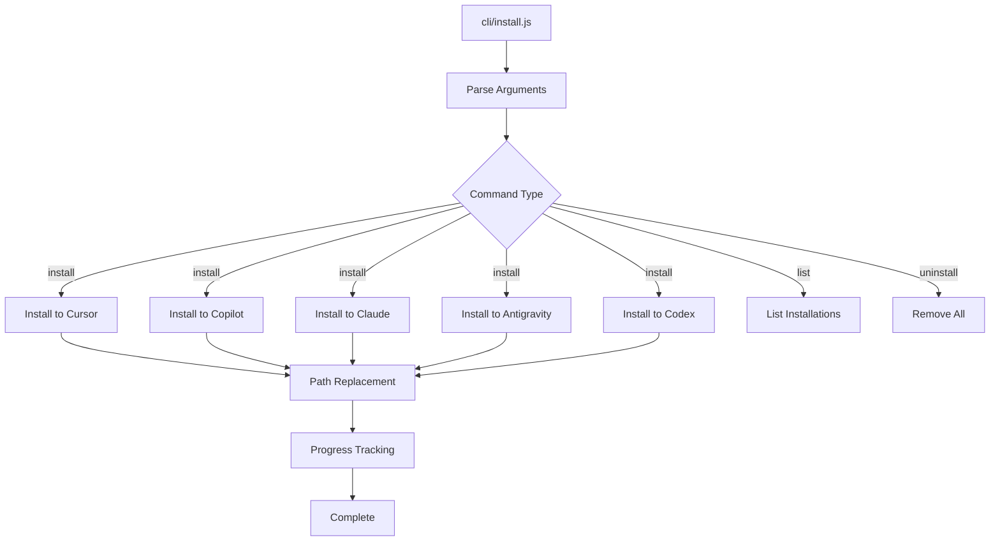
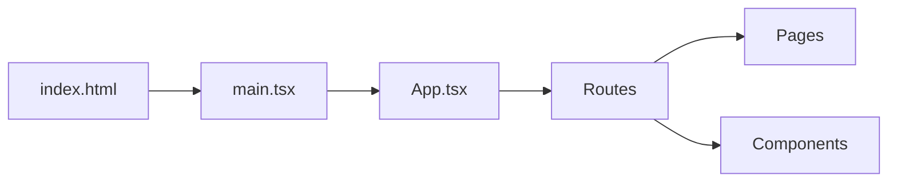
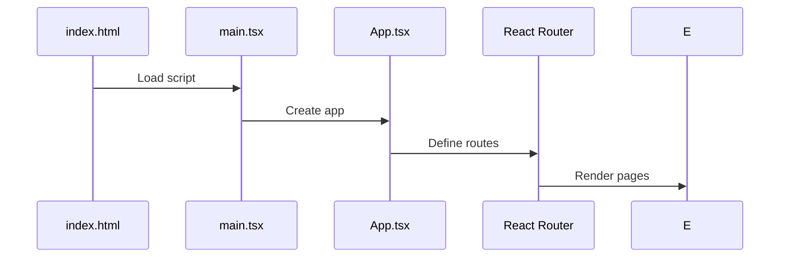
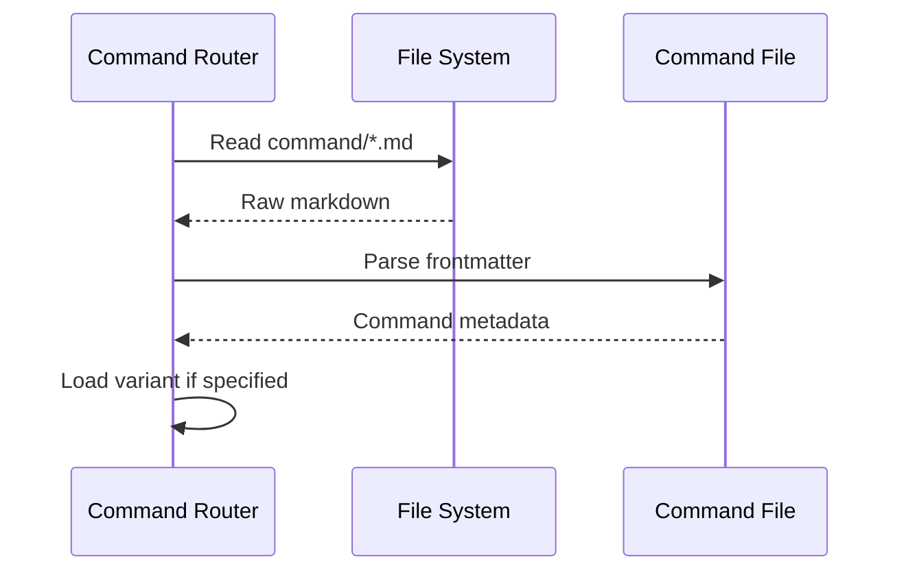
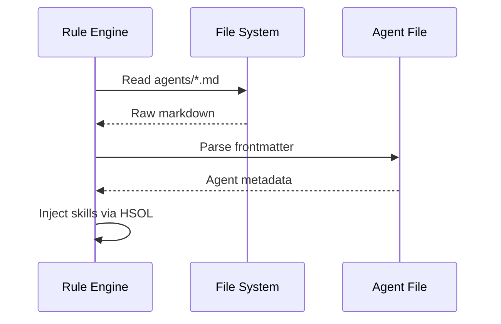
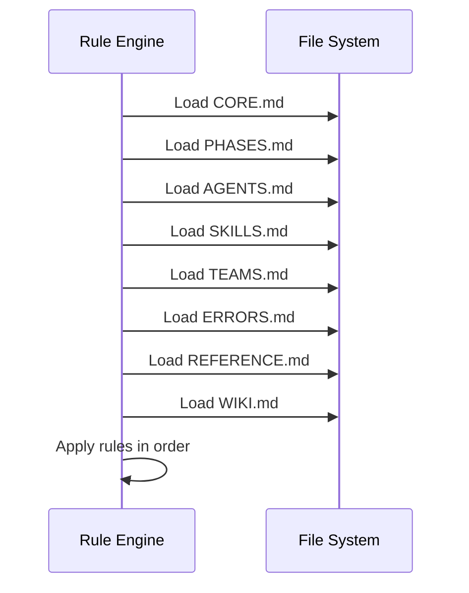
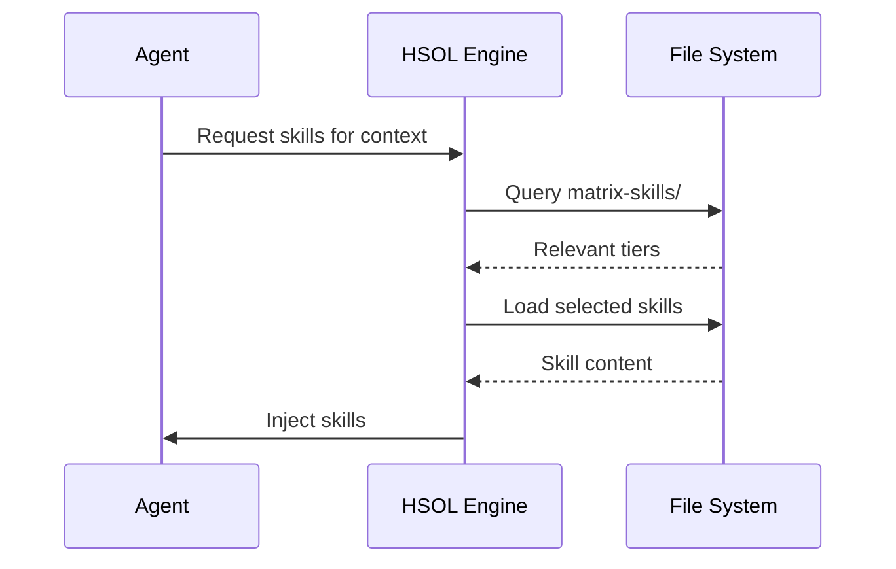
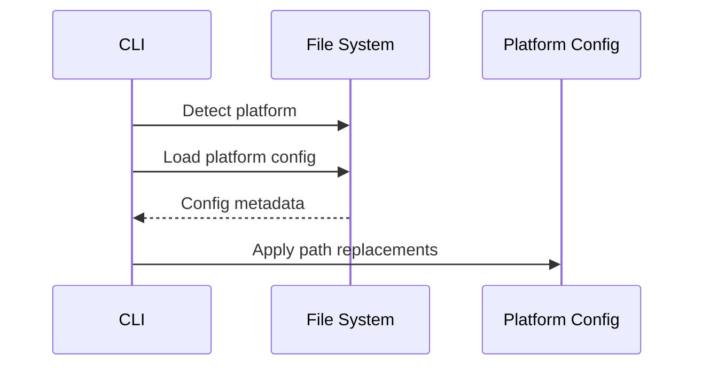

# Entry Points

> **File**: `.documents/knowledge-source-base/02-entry-points.md`
> **Purpose**: CLI and web entry points, command loading, agent loading

---

## Overview

Agent Assistant has two primary entry points:
1. **CLI Entry** — `cli/install.js` for installation and management
2. **Web Entry** — `web/src/main.tsx` for documentation site

---

## Entry Point 1: CLI

### Primary File

| File | Lines | Purpose |
|------|-------|---------|
| `cli/install.js` | 1716 | Main CLI installer |

### CLI Purpose

The CLI handles:
- Installing Agent Assistant to 7 AI platforms
- Uninstalling from platforms
- Listing current installations
- Path replacement for portability

### CLI Usage

```bash
# Install to all platforms
node cli/install.js

# List installed platforms
node cli/install.js --list

# Uninstall from all platforms
node cli/install.js --uninstall
```

### CLI Architecture



### Key Functions

| Function | Purpose |
|----------|---------|
| `parseArgs()` | Parse CLI arguments |
| `install()` | Main installation logic |
| `uninstall()` | Remove installations |
| `list()` | List current installations |
| `replacePaths()` | Replace platform path placeholders |
| `copyFiles()` | Copy files to target platforms |
| `progress()` | Display progress updates |

---

## Entry Point 2: Web Application

### Primary File

| File | Purpose |
|------|---------|
| `web/src/main.tsx` | React application entry |

### Web Application Structure



### Web Entry Flow



### Web Routes

| Path | Component | Description |
|------|----------|-------------|
| `/` | `HomePage.tsx` | Landing page |
| `/docs` | `Docs.tsx` | Documentation viewer |
| `/installation` | `Installation.tsx` | Installation guide |
| `/features/agent-teams` | `AgentTeams.tsx` | Agent teams feature |

---

## Command Loading

### Command Files Location
`commands/` folder

### Command Loading Process



### Command File Structure

```markdown
---
command: /cook
purpose: Implementation
variants: [fast, hard, team]
agents: [frontend-engineer, backend-engineer]
---

# Cook Command

## Overview
...
```

### Command Variants

Each command has a folder with variants:
```
commands/cook/
├── fast.md     # Fast variant (2-3 agents)
├── hard.md     # Hard variant (5-8 agents)
└── team.md    # Team variant (Golden Triangle)
```

---

## Agent Loading

### Agent Files Location
`agents/` folder

### Agent Loading Process



### Agent File Structure

```markdown
---
id: backend-engineer
name: Backend Engineer
role: implementation
profile: backend-development
reportsTo: tech-lead
consults:
  - database-architect
  - devops-engineer
standard: docs-as-code
---

# Backend Engineer

## Role Overview
...
```

---

## Rule Loading

### Rule Files Location
`rules/` folder

### Rule Loading Order

| Order | File | Purpose |
|-------|------|---------|
| 1 | `CORE.md` | Core principles |
| 2 | `PHASES.md` | Phase definitions |
| 3 | `AGENTS.md` | Agent definitions |
| 4 | `SKILLS.md` | Skill orchestration |
| 5 | `TEAMS.md` | Team coordination |
| 6 | `ERRORS.md` | Error handling |
| 7 | `REFERENCE.md` | Quick reference |
| 8 | `WIKI.md` | Wiki standards |

### Rule Loading Process



---

## Skill Loading (HSOL)

### Skill Files Location
`skills/`, `matrix-skills/` folders

### Skill Loading Process



### Skill Tier Organization

```
matrix-skills/
├── foundation/     # Loaded first
├── professional/   # If relevant
├── specialized/    # If domain match
└── expert/        # Only if requested
```

---

## Platform Config Loading

### Config Files Location
`code-assistants/` folder

### Platform Config Structure

| Platform | Config Location |
|----------|---------------|
| Cursor | `code-assistants/cursor/` |
| GitHub Copilot | `code-assistants/copilot/` |
| Claude Code | `code-assistants/claude/` |
| Antigravity | `code-assistants/antigravity/` |
| Codex | `code-assistants/codex/` |

### Config Loading Process



---

## Module Exports

### CLI Module

```javascript
// cli/install.js exports
module.exports = {
  install,      // Install to platforms
  uninstall,    // Remove installations
  list,         // List installations
  replacePaths  // Path replacement utility
};
```

### Web Module

```typescript
// web/src/main.tsx
import React from 'react';
import ReactDOM from 'react-dom/client';
import App from './App';

ReactDOM.createRoot(document.getElementById('root')!).render(
  <React.StrictMode>
    <App />
  </React.StrictMode>
);
```

---

## Evidence Sources

- `cli/install.js` — CLI implementation
- `web/src/main.tsx` — Web entry
- `commands/` — Command definitions
- `agents/` — Agent definitions
- `rules/` — Rule definitions
- `matrix-skills/` — Skill tiers
- `code-assistants/` — Platform configs
