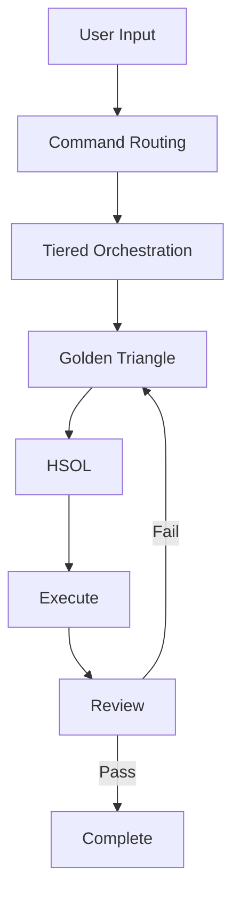
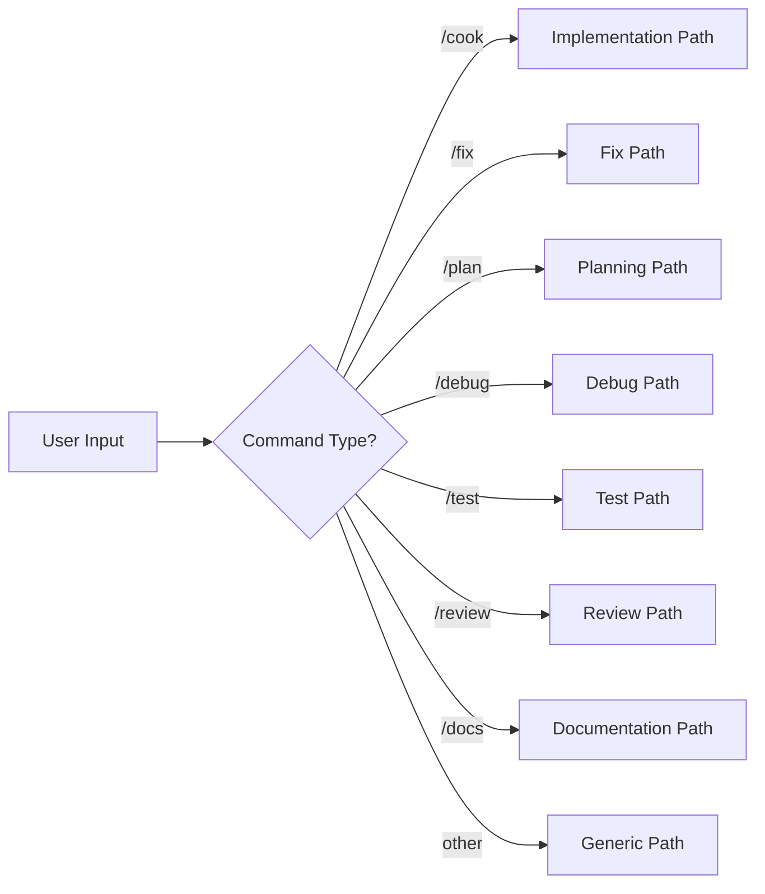
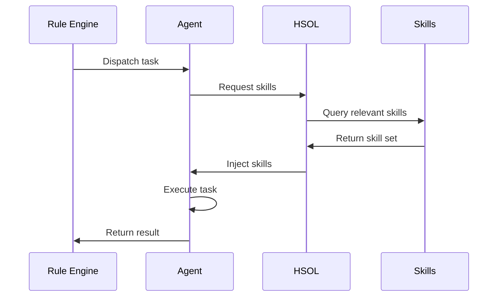
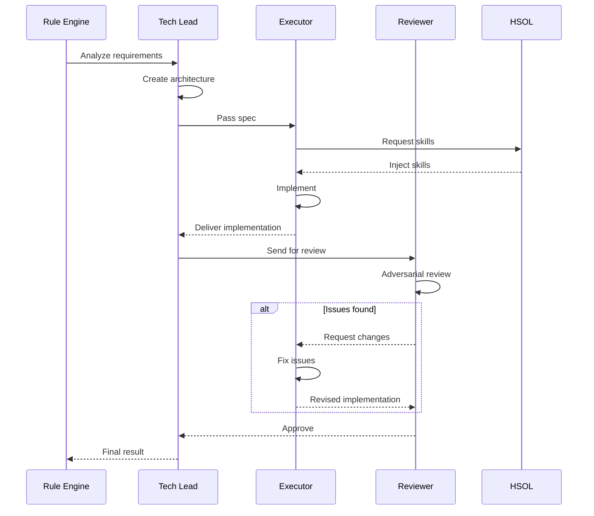
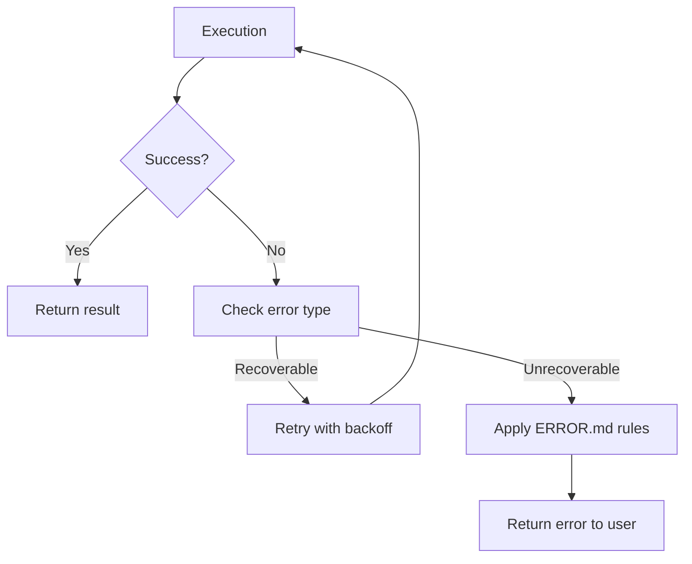

# Architecture Overview

The Agent Assistant uses a tiered orchestration architecture that decomposes user requests through 5 distinct layers. Each layer has a specific responsibility and communicates with adjacent layers through well-defined interfaces. This design separates concerns, enables independent testing, and scales complexity gracefully from simple single-agent tasks to full [[Golden Triangle]] team collaborations.

---

## High-Level Architecture Diagram

```mermaid
graph TB
    subgraph USER["User Interface"]
        U[User Input]
    end

    subgraph CMD["Command Layer"]
        C14[/cook\]
        C15[/fix\]
        C16[/plan\]
        C17[/debug\]
        C18[/test\]
        C19[/review\]
        C20[/docs\]
        C21[/design\]
        C22[/deploy\]
        C23[/report\]
        C24[/wiki\]
        C25[/brainstorm\]
        C26[/ask\]
        C27[/code\]
    end

    subgraph RULES["Rule Layer"]
        R1[CORE]
        R2[PHASES]
        R3[AGENTS]
        R4[SKILLS]
        R5[TEAMS]
        R6[ERRORS]
        R7[REFERENCE]
    end

    subgraph AGENTS["Agent Layer"]
        A1[backend-engineer]
        A2[frontend-engineer]
        A3[mobile-engineer]
        A4[game-engineer]
        A5[tech-lead]
        A6[database-architect]
        A7[tester]
        A8[reviewer]
        A9[debugger]
        A10[security-engineer]
        A11[performance-engineer]
        A12[wiki-reviewer]
        A13[planner]
        A14[brainstormer]
        A15[business-analyst]
        A16[designer]
        A17[devops-engineer]
        A18[docs-manager]
        A19[project-manager]
        A20[reporter]
        A21[researcher]
        A22[scouter]
        A23[wiki-architect]
        A24[wiki-extractor]
    end

    subgraph TEAMS["Team Layer"]
        T1[backend-team]
        T2[frontend-team]
        T3[fullstack-team]
        T4[database-team]
        T5[debug-team]
        T6[design-team]
        T7[devops-team]
        T8[docs-team]
        T9[game-team]
        T10[mobile-team]
        T11[performance-team]
        T12[planning-team]
        T13[project-team]
        T14[qa-team]
        T15[report-team]
        T16[research-team]
        T17[security-team]
        T18[wiki-team]
    end

    subgraph SKILLS["Skill Layer"]
        S1[foundation ~200]
        S2[professional ~400]
        S3[specialized ~500]
        S4[expert ~300]
    end

    U --> CMD
    CMD --> RULES
    RULES --> AGENTS
    AGENTS <--> TEAMS
    AGENTS --> SKILLS
    TEAMS --> SKILLS
```



**Source**: `documents/knowledge-architecture/01-system-overview.md:20-117`

---

## Tiered Orchestration Architecture

The 5-layer architecture processes every user request through a sequential pipeline:

| Layer | Name | Responsibility | Input | Output |
|-------|------|---------------|-------|--------|
| 1 | Command Layer | Parse intent, detect variant, route | User text command | Routed command to Rule Layer |
| 2 | Rule Layer | Load orchestration protocols | Routed command + context | Orchestration protocol |
| 3 | Agent Layer | Execute through specialists | Task from Rule Layer | Task result + skill injection |
| 4 | Team Layer | Coordinate multi-agent work | Complex task from Agent Layer | Coordinated multi-agent result |
| 5 | Skill Layer | Inject domain knowledge | Agent context + task | Relevant skills injected |

### Layer Boundaries

#### Layer 1: Command Layer

| Boundary | Description |
|----------|-------------|
| **Input** | User text commands (e.g., `/cook`, `/fix`) |
| **Output** | Routed command to Rule Layer |
| **Responsibility** | Parse intent, select variant, pass to rules |
| **Location** | `commands/` folder |

#### Layer 2: Rule Layer

| Boundary | Description |
|----------|-------------|
| **Input** | Routed command with context |
| **Output** | Orchestration protocol |
| **Responsibility** | Define execution order, agent selection |
| **Location** | `rules/` folder |

#### Layer 3: Agent Layer

| Boundary | Description |
|----------|-------------|
| **Input** | Task from Rule Layer |
| **Output** | Task result + skill injection |
| **Responsibility** | Execute specialized task |
| **Location** | `agents/` folder |

#### Layer 4: Team Layer

| Boundary | Description |
|----------|-------------|
| **Input** | Complex task from Agent Layer |
| **Output** | Coordinated multi-agent result |
| **Responsibility** | Coordinate adversarial review |
| **Location** | `agents/teams/` folder |

#### Layer 5: Skill Layer

| Boundary | Description |
|----------|-------------|
| **Input** | Agent context and task |
| **Output** | Relevant skills injected |
| **Responsibility** | Domain knowledge lookup |
| **Location** | `skills/`, `matrix-skills/` folders |

This architecture is the foundation for all [[Tiered Orchestration]] patterns in the system. Each layer can be tested independently, and the tiered approach means simple tasks only travel as deep as needed.

**Source**: `documents/knowledge-architecture/01-system-overview.md:1-166`

---

## Component Interaction

### Horizontal Communication

Commands flow downward through layers:

```
User → Command → Rules → Agent → Output
```

### Vertical Communication

Teams communicate across agent types:

```
Tech Lead ↔ Executor ↔ Reviewer
```

### Skill Injection

Skills inject horizontally into any layer:

```
Agent ← HSOL → Skills
```

**Source**: `documents/knowledge-architecture/01-system-overview.md:170-194`

---

## System Components

Agent Assistant consists of seven major components:

1. **Commands** — Primary interface for user interaction
2. **Rules** — Orchestration protocols and constraints
3. **Agents** — Execution units for specialized tasks
4. **Teams** — Coordinated multi-agent groups
5. **Skills** — Domain-specific knowledge base
6. **CLI** — Multi-platform installer
7. **Web** — React documentation site

### Component 1: Commands

| Property | Value |
|----------|-------|
| **Location** | `commands/` folder |
| **Commands** | 14 core commands with 3 variants each |
| **Executor Types** | Specialist agents per command type |

#### Command Types

| Command | Primary Use | Executor |
|---------|------------|----------|
| `/cook` | Implementation | frontend-engineer, backend-engineer |
| `/code` | Code generation | frontend-engineer, backend-engineer |
| `/fix` | Bug fixing | debugger |
| `/plan` | Planning | planner |
| `/debug` | Debugging | debugger |
| `/test` | Testing | tester |
| `/review` | Code review | reviewer |
| `/docs` | Documentation | docs-manager |
| `/design` | Design | designer |
| `/deploy` | Deployment | devops-engineer |
| `/report` | Reporting | reporter |
| `/wiki` | Wiki generation | wiki-architect |
| `/brainstorm` | Ideation | brainstormer |
| `/ask` | Questions | researcher |

#### Command Variants

| Variant | Agent Count | Use Case |
|---------|-------------|----------|
| fast | 2-3 | Quick tasks, simple features |
| hard | 5-8 | Complex features with quality gates |
| team | Golden Triangle | Critical tasks requiring adversarial review |

### Component 2: Rules

| Property | Value |
|----------|-------|
| **Location** | `rules/` folder |
| **Files** | 8 rule files |
| **Purpose** | Orchestration protocols |

#### Rule Files

| File | Purpose | Key Content |
|------|---------|-------------|
| `CORE.md` | Core orchestration | Main principles |
| `PHASES.md` | Phase definitions | Task phases and transitions |
| `AGENTS.md` | Agent definitions | 21 agents with roles |
| `SKILLS.md` | Skill orchestration | HSOL configuration |
| `TEAMS.md` | Team definitions | Golden Triangle protocol |
| `ERRORS.md` | Error handling | Error codes and recovery |
| `REFERENCE.md` | Quick reference | Patterns and templates |
| `WIKI.md` | Wiki rules | Documentation standards |

#### Rule Categories

| Category | Count | Examples |
|----------|-------|----------|
| Orchestration | 3 | CORE, PHASES, TEAMS |
| Execution | 3 | AGENTS, SKILLS, ERRORS |
| Reference | 2 | REFERENCE, WIKI |

### Component 3: Agents

| Property | Value |
|----------|-------|
| **Location** | `agents/` folder |
| **Total Count** | 21 specialist agents |
| **Purpose** | Execute specialized tasks |

#### Implementation Agents (4)

| Agent | Role | Primary Skills |
|-------|------|----------------|
| `backend-engineer.md` | Server-side development | Node.js, Python, databases |
| `frontend-engineer.md` | Frontend development | React, CSS, accessibility |
| `mobile-engineer.md` | Mobile development | React Native, Swift, Kotlin |
| `game-engineer.md` | Game development | Unity, Three.js, WebGL |

#### Architecture Agents (1)

| Agent | Role | Primary Skills |
|-------|------|----------------|
| `tech-lead.md` | Technical leadership | System design, trade-offs |

#### Quality Agents (6)

| Agent | Role | Primary Skills |
|-------|------|----------------|
| `tester.md` | Test creation | Unit, integration, e2e |
| `reviewer.md` | Code review | Best practices, patterns |
| `debugger.md` | Bug investigation | Root cause analysis |
| `security-engineer.md` | Security audit | OWASP, vulnerabilities |
| `performance-engineer.md` | Optimization | Profiling, benchmarks |
| `wiki-reviewer.md` | Docs quality | Clarity, accuracy |

#### Planning Agents (3)

| Agent | Role | Primary Skills |
|-------|------|----------------|
| `planner.md` | Implementation blueprints | Breakdown, estimation |
| `brainstormer.md` | Ideas and alternatives | Creative thinking |
| `business-analyst.md` | Requirements analysis | User stories |

#### Support Agents (10)

| Agent | Role | Primary Skills |
|-------|------|----------------|
| `designer.md` | UI/UX design | Figma, components |
| `devops-engineer.md` | Infrastructure | CI/CD, containers |
| `docs-manager.md` | Documentation | Technical writing |
| `project-manager.md` | Project coordination | Agile, planning |
| `reporter.md` | Data analysis | Metrics, insights |
| `researcher.md` | Investigation | Research, synthesis |
| `scouter.md` | Code exploration | Pattern discovery |
| `wiki-architect.md` | Wiki structure | Knowledge organization |
| `wiki-extractor.md` | Code documentation | JSDoc, docstrings |
| `database-architect.md` | Data layer design | Schema, queries |

### Component 4: Teams

| Property | Value |
|----------|-------|
| **Location** | `agents/teams/` folder |
| **Count** | 18 domain teams |
| **Pattern** | Golden Triangle |

#### Team Files

| File | Primary Domain | Executor |
|------|----------------|----------|
| `backend-team/executor.md` | Backend | backend-engineer |
| `backend-team/reviewer.md` | Backend | reviewer |
| `backend-team/techlead.md` | Backend | tech-lead |
| `frontend-team/executor.md` | Frontend | frontend-engineer |
| `frontend-team/reviewer.md` | Frontend | reviewer |
| `frontend-team/techlead.md` | Frontend | tech-lead |
| ... (15 more teams) | ... | ... |

#### Team Workflow

1. **Tech Lead** — Analyzes requirements, creates architecture
2. **Executor** — Implements according to spec
3. **Reviewer** — Adversarial review, finds issues
4. **Iteration** — Loop until quality gates pass

### Component 5: Skills

| Property | Value |
|----------|-------|
| **Location** | `skills/`, `matrix-skills/` folders |
| **Total Count** | 1400+ skills |
| **Purpose** | Domain knowledge injection |

#### Skill Tiers

| Tier | Count | Purpose | Examples |
|------|-------|---------|----------|
| foundation | ~200 | Core skills | JavaScript, git |
| professional | ~400 | Industry standard | React, SQL |
| specialized | ~500 | Domain expertise | Kubernetes, TensorFlow |
| expert | ~300 | Advanced topics | Distributed systems |

#### HSOL Functions

| Function | Description |
|----------|-------------|
| Context Detection | Analyze current task |
| Skill Matching | Find relevant skills |
| Injection | Add skills to agent context |
| Priority | Rank by relevance |

### Component 6: CLI

| Property | Value |
|----------|-------|
| **Location** | `cli/` folder |
| **File** | `cli/install.js` (1716 lines) |
| **Purpose** | Multi-platform installer |

#### CLI Features

| Feature | Description |
|---------|-------------|
| Multi-platform | Installs to Cursor, Copilot, Claude, Antigravity, Codex |
| Progress tracking | Visual status updates |
| Path replacement | Automatic portability fixes |
| Reliability | Uses fsync for durability |

#### CLI Commands

| Command | Action |
|---------|--------|
| `node cli/install.js` | Install to all platforms |
| `node cli/install.js --list` | List installations |
| `node cli/install.js --uninstall` | Remove installations |

### Component 7: Web

| Property | Value |
|----------|-------|
| **Location** | `web/` folder |
| **Type** | React documentation site |
| **Purpose** | Human-readable documentation |

#### Technology Stack

| Technology | Purpose |
|-----------|---------|
| React 19 | UI framework |
| Vite 6 | Build tool |
| TypeScript | Type safety |
| Tailwind CSS 4 | Styling |
| React Router 7 | Routing |
| Framer Motion 12 | Animations |
| ReactFlow 12 | Workflow visualization |

#### Pages

| Page | Path | Description |
|------|------|-------------|
| Docs | `/docs` | Documentation viewer |
| Home | `/` | Landing page |
| Installation | `/installation` | Setup guide |
| Features | `/features/*` | Feature documentation |

**Source**: `documents/knowledge-architecture/02-components.md:1-332`

---

## Design Patterns

The architecture is built on 4 core design patterns that address specific challenges in AI-assisted development:

### Pattern 1: Tiered Orchestration Pattern

Layered command processing with 5 distinct layers. Each layer is independently testable and can be swapped without affecting others. The separation enables the system to scale from simple tasks (Command Layer → Rule Layer → Agent Layer, done) to complex tasks (full 5-layer traversal with team coordination).

**Benefits**: Separation of concerns, scalability, maintainability, testability.

#### Implementation Locations

| Layer | Implementation | Location |
|-------|----------------|----------|
| Commands | Markdown files | `commands/` |
| Rules | Markdown files | `rules/` |
| Agents | Markdown files | `agents/` |
| Teams | Markdown folders | `agents/teams/` |
| Skills | Markdown files | `skills/` |

### Pattern 2: Golden Triangle Pattern

Adversarial 3-role team coordination for quality-critical tasks. Every significant deliverable goes through a Tech Lead (architecture), Executor (implementation), and Reviewer (adversarial quality gate). The Reviewer actively challenges the Executor's work, creating productive tension that catches defects before they ship.

#### Roles

| Role | Primary Responsibility | Secondary Responsibility |
|------|------------------------|------------------------|
| **Tech Lead** | Architecture | Coordination |
| **Executor** | Implementation | Testing |
| **Reviewer** | Quality assurance | Security |

#### Quality Gates

| Gate | Reviewer Check | Pass Criteria |
|------|---------------|---------------|
| Security | OWASP Top 10 | No vulnerabilities |
| Performance | Load test | < 200ms response |
| Testing | Coverage | > 80% coverage |
| Style | Linting | No errors |

#### Teams Using Golden Triangle

All 18 teams use this pattern:
- `backend-team`, `frontend-team`, `fullstack-team`
- `database-team`, `debug-team`, `design-team`
- `devops-team`, `docs-team`, `game-team`
- `mobile-team`, `performance-team`, `planning-team`
- `project-team`, `qa-team`, `report-team`
- `research-team`, `security-team`, `wiki-team`

See [[Golden Triangle]] for the full pattern description and [[Team System]] for the 18 teams.

### Pattern 3: HSOL Skill Injection Pattern

Hybrid Skill Orchestration Layer solves the context overflow problem — providing enough domain knowledge without exceeding the context window. The 5-step algorithm selects the most relevant skills from a pool of 1400+.

#### Skill Selection Algorithm

1. **Context Analysis** — Parse current file, command, project type
2. **Domain Matching** — Match against skill domains
3. **Priority Calculation** — Rank by relevance
4. **Context Window Fit** — Ensure within context limit
5. **Injection** — Add skills to agent context

#### Skill Tier Triggers

| Tier | Trigger | Example |
|------|---------|---------|
| foundation | Always | JavaScript, git |
| professional | Task relevant | React, SQL |
| specialized | Domain match | Kubernetes, TensorFlow |
| expert | Explicit need | Distributed systems |

See [[HSOL Skill Injection]] and [[Skill System]].

### Pattern 4: Command Routing Pattern

Three-tier variant execution that scales with task complexity:

| Variant | Agent Count | Use Case |
|---------|-------------|----------|
| fast | 2–3 agents | Quick fixes, simple features |
| hard | 5–8 agents | Complex features, multi-component work |
| team | Golden Triangle | High-stakes work requiring adversarial review |

#### Command-Variant Matrix

| Command | Fast | Hard | Team |
|---------|------|------|------|
| `/cook` | ✓ | ✓ | ✓ |
| `/code` | ✓ | ✓ | ✓ |
| `/fix` | ✓ | ✓ | ✓ |
| `/plan` | ✓ | ✓ | ✓ |
| `/debug` | ✓ | ✓ | ✓ |
| `/test` | ✓ | ✓ | ✓ |
| `/review` | ✓ | ✓ | ✓ |
| `/docs` | ✓ | ✓ | ✓ |
| `/design` | ✓ | ✓ | ✓ |
| `/deploy` | ✓ | ✓ | ✓ |
| `/report` | ✓ | ✓ | ✓ |
| `/wiki` | ✓ | ✓ | ✓ |
| `/brainstorm` | ✓ | ✓ | ✓ |
| `/ask` | ✓ | ✓ | ✓ |

See [[Command Routing]] and [[Command Variant Matrix]] for variant selection guidance.

### Pattern Interaction

These patterns work together:



#### Interaction Sequence

1. **Command Routing** — Determines execution path
2. **Tiered Orchestration** — Structures the execution
3. **Golden Triangle** — Coordinates the team
4. **HSOL** — Injects relevant skills
5. **Review** — Validates quality

**Source**: `documents/knowledge-architecture/04-design-patterns.md:19-334`

---

## Data Flow

The 5-stage data flow pipeline processes every user request:

```
Stage 1: User Input
  └─ Terminal, chat, or IDE text commands
      ↓
Stage 2: Command Routing
  └─ Parse intent, detect variant, route to appropriate path
      ↓
Stage 3: Rule Application
  └─ Load CORE → PHASES → AGENTS → SKILLS in order
      ↓
Stage 4: Agent Execution
  └─ Single agent (fast), multi-agent (hard), or Golden Triangle (team)
      ↓
Stage 5: Output
  └─ Code files, documentation, reports, or review comments
```

### Stage 1: User Input

#### Input Sources

| Source | Format | Example |
|--------|--------|---------|
| Terminal | Text command | `/cook`, `/fix`, `/plan` |
| Chat | Natural language | "Build a login form" |
| IDE | Inline command | `/fix bug in auth` |

#### Input Fields

| Field | Type | Description |
|-------|------|-------------|
| `command` | string | Primary command (e.g., `/cook`) |
| `variant` | enum | `fast`, `hard`, `team` |
| `params` | object | Command-specific parameters |
| `context` | object | Current file, project state |

### Stage 2: Command Routing

#### Routing Logic



#### Variant Selection

| Variant | Trigger | Agents | Gating |
|---------|---------|--------|--------|
| fast | Default, `/cmd` | 2-3 | Basic review |
| hard | `/cmd:hard` | 5-8 | Full quality gates |
| team | `/cmd:team` | Golden Triangle | Adversarial review |

#### Routing Rules

1. **Parse command** — Extract base command from `/command:variant`
2. **Load rules** — Read corresponding command file from `commands/`
3. **Select agents** — Determine agents based on variant
4. **Inject context** — Add project context, file state

### Stage 3: Rule Application

#### Rule Loading Sequence

| Order | Rule | Purpose |
|-------|------|---------|
| 1 | `CORE.md` | Core principles and constraints |
| 2 | `PHASES.md` | Phase definitions and transitions |
| 3 | `AGENTS.md` | Agent selection and roles |
| 4 | `SKILLS.md` | Skill injection configuration |
| 5 | `TEAMS.md` | Team coordination (if team variant) |

#### Rule Variables

| Variable | Source | Available In |
|----------|--------|--------------|
| `{{COMMAND}}` | Command layer | Rules, agents |
| `{{VARIANT}}` | Command layer | Rules, agents |
| `{{AGENT}}` | Agent layer | Rules, agents |
| `{{SKILLS}}` | Skill layer | Agents |

### Stage 4: Agent Execution

#### Single Agent Flow (Fast Variant)



#### Multi-Agent Flow (Hard Variant)

Multiple agents execute in parallel, each requesting and receiving relevant skills from HSOL before execution.

#### Golden Triangle Flow (Team Variant)



### Stage 5: Output

#### Output Types

| Type | Format | Example |
|------|--------|---------|
| Code | Files, patches | New component files |
| Documentation | Markdown | API docs |
| Report | Structured data | Bug analysis |
| Review | Comments | Code review notes |

### Error Handling

#### Error Flow



#### Error Types

| Type | Behavior | Example |
|------|----------|---------|
| Agent failure | Retry 3x, then fail | Agent crash |
| Skill missing | Fallback to generic | Unknown domain |
| Path error | Use default paths | Invalid platform path |

Error handling is integrated at every stage with a 3-retry backoff policy. Errors are classified by severity (Warning, Error, Critical) and propagated through the chain.

**Source**: `documents/knowledge-architecture/03-data-flow.md:1-317`

---

## Orchestration Laws

The system operates under 10 fundamental Orchestration Laws (L1-L10) that govern all behavior:

| Law | Name | Description |
|-----|------|-------------|
| L1 | Single Point of Truth | Entry file loads CORE; rest loaded on-demand |
| L2 | Requirement Integrity | 100% fidelity extraction; zero loss, parse EVERY requirement |
| L3 | Explicit Loading | State what you loaded before using |
| L4 | Deep Embodiment | Follow agent's Directive + Protocol + Constraints |
| L5 | Sequential Execution | Phase N completes before N+1 |
| L6 | Language Compliance | Respond in user's language; files/code in English |
| L7 | Recursive Delegation | Meta agents coordinate, NEVER implement |
| L8 | Stateful Handoff | Prior deliverables = IMMUTABLE constraints |
| L9 | Constraint Propagation | scouter→planner→implementer chain locked |
| L10 | Deliverable Integrity | Files created by agent define standard |

#### Law Violations

| Law Violation | Detection |
|---------------|-----------|
| L2: Missing requirement | Requirement registry check |
| L5: Phase N+1 before N | Phase sequencing enforcement |
| L7: Meta implementing | Agent category check |

**Source**: `documents/business/business-features/03-feature-specifications.md:170-227`

---

## Multi-Platform Abstraction

A single codebase works across 7 AI assistant platforms:

| Platform | Path | Path Placeholder |
|----------|------|------------------|
| Cursor | `~/.cursor/` | `{{CURSOR_PATH}}` |
| GitHub Copilot | `~/.github/copilot/` | `{{COPILOT_PATH}}` |
| Claude Code | `~/.claude/` | `{{CLAUDE_PATH}}` |
| Antigravity/Gemini | `~/.antigravity/` | `{{ANTIGRAVITY_PATH}}` |
| Codex | `~/.codex/` | `{{CODEX_PATH}}` |

Path resolution follows a detection priority: explicit config → environment variable → file markers → default path. Each platform directory contains platform-specific instructions and configuration.

### Platform Abstraction Benefits

| Benefit | Description |
|---------|-------------|
| **Portability** | Same commands work everywhere |
| **Consistency** | Unified experience |
| **Maintainability** | Single codebase |
| **Extensibility** | Easy to add platforms |

See [[Platform System]] for the full platform abstraction details.

---

## Scalability Characteristics

| Metric | Current | Notes |
|--------|---------|-------|
| Agents | 20 | Specialist-based |
| Commands | 14 | Core + extended |
| Teams | 18 | Domain teams |
| Skills | 1400+ | Tiered by expertise |

**Source**: `documents/knowledge-architecture/01-system-overview.md:229-237`

---

## Architecture Decisions

The following Architecture Decision Records (ADRs) shaped the current architecture:

| ADR | Decision | Rationale |
|-----|----------|-----------|
| ADR-001 | Multi-platform abstraction layer | Platform portability — single codebase works on all 7 platforms |
| ADR-002 | Markdown-based agent definitions | AI/LLM consumability — agents are defined as Markdown with YAML frontmatter |
| ADR-003 | HSOL skill injection | Context optimization — solves the context window overflow problem for 1400+ skills |
| ADR-004 | Golden Triangle adversarial teams | Quality assurance — adversarial review catches defects before they ship |
| ADR-005 | Tiered command variants (fast/hard/team) | Scalable complexity — simple tasks are fast, complex tasks get full review |
| ADR-006 | Single-file CLI installer | Simplicity — 1716-line install.js with no framework dependencies |
| ADR-007 | File-based configuration | No database — all config is human-editable Markdown/TOML, git-friendly |
| ADR-008 | 21 specialist agents (not general) | Quality over coverage — focused agents produce better results than one general agent |

See [[Architecture Decisions]] for the full ADR details.

---

## Related Pages

- [[Tiered Orchestration]] — Deep dive into the 5-layer pattern
- [[Golden Triangle]] — Adversarial team coordination
- [[HSOL Skill Injection]] — Context-aware skill injection
- [[Command Routing]] — Three-tier variant execution
- [[Business PMD]] — Process, metrics, and definitions
- [[Feature Catalogue]] — Complete feature inventory
- [[System Components]] — Complete component inventory
- [[Architecture Decisions]] — All 8 ADRs
