# Knowledge Graph

Auto-generated. Rebuild: `python scripts/graph.py`

**42 nodes**, **~175 edges**

## Statistics

| Category | Count | Files |
|----------|-------|-------|
| Summaries | 10 | project-overview, project-identity, architecture-overview, system-components, directory-structure, business-pmd, feature-catalogue, workflow-system, success-metrics, tech-stack |
| Entities | 14 | actor-map, agent-system, cli-installer, command-system, configuration-reference, entry-points, key-modules, platform-system, rule-system, skill-system, skill-tier-reference, team-system, web-application, workflow-catalog |
| Concepts | 8 | business-rules, command-routing, entity-relationships, glossary-index, golden-triangle, hsol-skill-injection, terminology, tiered-orchestration |
| Decisions | 3 | architecture-decisions, code-style-guide, naming-and-frontmatter |
| Chronicles | 2 | getting-started, git-workflow |
| Runbooks | 4 | detailed-workflows, error-handling, sla-and-handoffs, testing-standards |
| Comparisons | 1 | command-variant-matrix |

## Top Referenced Pages

| Page | In-Degree | Primary Category |
|------|-----------|-----------------|
| Golden Triangle | 56 | concept |
| Agent System | 39 | entity |
| Command System | 35 | entity |
| HSOL Skill Injection | 22 | concept |
| Tiered Orchestration | 22 | concept |
| Skill System | 21 | entity |
| Rule System | 17 | entity |
| CLI Installer | 18 | entity |
| Architecture Overview | 16 | summary |
| Team System | 15 | entity |
| Workflow System | 10 | summary |
| Configuration Reference | 9 | entity |
| Platform System | 6 | entity |
| Feature Catalogue | 8 | summary |
| SLA and Handoffs | 6 | runbook |

```mermaid
graph LR
    classDef summary fill:#e1f5fe,stroke:#0288d1
    classDef entity fill:#f3e5f5,stroke:#7b1fa2
    classDef concept fill:#e8f5e9,stroke:#388e3c
    classDef comparison fill:#fff3e0,stroke:#f57c00
    classDef chronicle fill:#f5f5f5,stroke:#616161
    classDef adr fill:#e0f2f1,stroke:#00695c
    classDef runbook fill:#fff9c4,stroke:#f9a825

    %% ===================== SUMMARY NODES (10) =====================
    ProjectOverview["Project Overview"]:::summary
    ProjectIdentity["Project Identity"]:::summary
    ArchitectureOverview["Architecture Overview"]:::summary
    SystemComponents["System Components"]:::summary
    DirectoryStructure["Directory Structure"]:::summary
    BusinessPMD["Business PMD"]:::summary
    FeatureCatalogue["Feature Catalogue"]:::summary
    WorkflowSystem["Workflow System"]:::summary
    SuccessMetrics["Success Metrics"]:::summary
    TechStack["Tech Stack"]:::summary

    %% ===================== ENTITY NODES (14) =====================
    ActorMap["Actor Map"]:::entity
    AgentSystem["Agent System"]:::entity
    CLIInstaller["CLI Installer"]:::entity
    CommandSystem["Command System"]:::entity
    ConfigurationReference["Configuration Reference"]:::entity
    EntryPoints["Entry Points"]:::entity
    KeyModules["Key Modules"]:::entity
    PlatformSystem["Platform System"]:::entity
    RuleSystem["Rule System"]:::entity
    SkillSystem["Skill System"]:::entity
    SkillTierReference["Skill Tier Reference"]:::entity
    TeamSystem["Team System"]:::entity
    WebApplication["Web Application"]:::entity
    WorkflowCatalog["Workflow Catalog"]:::entity

    %% ===================== CONCEPT NODES (8) =====================
    BusinessRules["Business Rules"]:::concept
    CommandRouting["Command Routing"]:::concept
    EntityRelationships["Entity Relationships"]:::concept
    GlossaryIndex["Glossary Index"]:::concept
    GoldenTriangle["Golden Triangle"]:::concept
    HSOLSkillInjection["HSOL Skill Injection"]:::concept
    Terminology["Terminology"]:::concept
    TieredOrchestration["Tiered Orchestration"]:::concept

    %% ===================== DECISION NODES (3) =====================
    ArchitectureDecisions["Architecture Decisions"]:::adr
    CodeStyleGuide["Code Style Guide"]:::adr
    NamingFrontmatter["Naming & Frontmatter"]:::adr

    %% ===================== CHRONICLE NODES (2) =====================
    GettingStarted["Getting Started"]:::chronicle
    GitWorkflow["Git Workflow"]:::chronicle

    %% ===================== RUNBOOK NODES (4) =====================
    DetailedWorkflows["Detailed Workflows"]:::runbook
    ErrorHandling["Error Handling"]:::runbook
    SLAandHandoffs["SLA and Handoffs"]:::runbook
    TestingStandards["Testing Standards"]:::runbook

    %% ===================== COMPARISON NODES (1) =====================
    CommandVariantMatrix["Command Variant Matrix"]:::comparison

    %% ===================== CORE ARCHITECTURE FLOW =====================
    ProjectOverview --> ArchitectureOverview
    ProjectOverview --> ProjectIdentity
    ProjectOverview --> TechStack
    ProjectOverview --> GettingStarted
    ProjectOverview --> GlossaryIndex

    ArchitectureOverview --> TieredOrchestration
    ArchitectureOverview --> GoldenTriangle
    ArchitectureOverview --> CommandRouting
    ArchitectureOverview --> HSOLSkillInjection
    ArchitectureOverview --> EntityRelationships
    ArchitectureOverview --> SystemComponents
    ArchitectureOverview --> SkillSystem
    ArchitectureOverview --> AgentSystem
    ArchitectureOverview --> TeamSystem
    ArchitectureOverview --> CommandSystem
    ArchitectureOverview --> RuleSystem

    %% ===================== BUSINESS PMD CONNECTIONS =====================
    BusinessPMD --> FeatureCatalogue
    BusinessPMD --> WorkflowSystem
    BusinessPMD --> Terminology
    BusinessPMD --> SuccessMetrics
    BusinessPMD --> ActorMap
    BusinessPMD --> TechStack
    BusinessPMD --> DirectoryStructure

    %% ===================== FEATURE CATALOGUE CONNECTIONS =====================
    FeatureCatalogue --> CommandRouting
    FeatureCatalogue --> TieredOrchestration
    FeatureCatalogue --> GoldenTriangle
    FeatureCatalogue --> CLIInstaller
    FeatureCatalogue --> SuccessMetrics
    FeatureCatalogue --> SkillSystem

    %% ===================== WORKFLOW SYSTEM CONNECTIONS =====================
    WorkflowSystem --> ActorMap
    WorkflowSystem --> WorkflowCatalog
    WorkflowSystem --> DetailedWorkflows
    WorkflowSystem --> SLAandHandoffs
    WorkflowSystem --> ErrorHandling

    WorkflowCatalog --> CommandSystem
    WorkflowCatalog --> TieredOrchestration
    WorkflowCatalog --> ActorMap

    DetailedWorkflows --> SLAandHandoffs
    DetailedWorkflows --> ActorMap
    DetailedWorkflows --> ErrorHandling

    %% ===================== COMMAND SYSTEM CONNECTIONS =====================
    CommandSystem --> TieredOrchestration
    CommandSystem --> GoldenTriangle
    CommandSystem --> CommandVariantMatrix
    CommandSystem --> CommandRouting
    CommandSystem --> RuleSystem
    CommandSystem --> GlossaryIndex

    CommandRouting --> TieredOrchestration
    CommandRouting --> CommandSystem
    CommandRouting --> GlossaryIndex
    CommandRouting --> EntityRelationships

    CommandVariantMatrix --> CommandSystem
    CommandVariantMatrix --> CommandRouting

    %% ===================== AGENT & TEAM SYSTEMS =====================
    GoldenTriangle --> TeamSystem
    GoldenTriangle --> AgentSystem
    GoldenTriangle --> SkillSystem
    GoldenTriangle --> SkillTierReference
    GoldenTriangle --> GlossaryIndex

    AgentSystem --> SkillSystem
    AgentSystem --> CommandSystem
    AgentSystem --> RuleSystem
    AgentSystem --> TeamSystem
    AgentSystem --> WebApplication
    AgentSystem --> GlossaryIndex

    TeamSystem --> AgentSystem
    TeamSystem --> SkillSystem
    TeamSystem --> WebApplication
    TeamSystem --> ConfigurationReference

    %% ===================== SKILL SYSTEM =====================
    SkillSystem --> SkillTierReference
    SkillSystem --> HSOLSkillInjection
    SkillSystem --> GlossaryIndex
    SkillSystem --> ConfigurationReference

    HSOLSkillInjection --> TieredOrchestration
    HSOLSkillInjection --> GlossaryIndex

    SkillTierReference --> GlossaryIndex

    TieredOrchestration --> GoldenTriangle
    TieredOrchestration --> CommandRouting
    TieredOrchestration --> GlossaryIndex

    %% ===================== RULE SYSTEM =====================
    RuleSystem --> GlossaryIndex
    RuleSystem --> BusinessRules
    RuleSystem --> EntityRelationships
    RuleSystem --> ArchitectureDecisions

    BusinessRules --> ErrorHandling
    BusinessRules --> Terminology

    %% ===================== PLATFORM & INFRASTRUCTURE =====================
    PlatformSystem --> CLIInstaller
    PlatformSystem --> ConfigurationReference
    PlatformSystem --> EntryPoints
    PlatformSystem --> WebApplication

    CLIInstaller --> EntryPoints
    CLIInstaller --> GettingStarted
    CLIInstaller --> GlossaryIndex

    WebApplication --> AgentSystem
    WebApplication --> TeamSystem
    WebApplication --> GlossaryIndex

    %% ===================== REFERENCE & GLOSSARY =====================
    GlossaryIndex --> Terminology
    GlossaryIndex --> EntityRelationships

    Terminology --> GlossaryIndex
    Terminology --> ArchitectureDecisions
    Terminology --> CodeStyleGuide

    EntityRelationships --> GlossaryIndex
    EntityRelationships --> Terminology

    ConfigurationReference --> GlossaryIndex
    ConfigurationReference --> ArchitectureDecisions

    EntryPoints --> GlossaryIndex

    KeyModules --> GlossaryIndex
    KeyModules --> ArchitectureOverview

    %% ===================== DECISIONS =====================
    ArchitectureDecisions --> TieredOrchestration
    ArchitectureDecisions --> GoldenTriangle
    ArchitectureDecisions --> HSOLSkillInjection
    ArchitectureDecisions --> CommandRouting

    CodeStyleGuide --> GlossaryIndex
    NamingFrontmatter --> CodeStyleGuide
    NamingFrontmatter --> GlossaryIndex

    %% ===================== CHRONICLES =====================
    GettingStarted --> CLIInstaller
    GettingStarted --> ArchitectureOverview
    GettingStarted --> GlossaryIndex

    GitWorkflow --> GlossaryIndex
    GitWorkflow --> CodeStyleGuide
    GitWorkflow --> ArchitectureDecisions

    %% ===================== RUNBOOKS =====================
    ErrorHandling --> BusinessRules
    ErrorHandling --> RuleSystem
    ErrorHandling --> ConfigurationReference

    TestingStandards --> GlossaryIndex
    TestingStandards --> ArchitectureDecisions

    SLAandHandoffs --> GlossaryIndex
    SLAandHandoffs --> BusinessRules
    SLAandHandoffs --> Terminology
```

## Edge Summary by Category

| From Category | To Category | Count |
|---------------|-------------|-------|
| summary | summary | 2 |
| summary | entity | 12 |
| summary | concept | 6 |
| summary | runbook | 2 |
| entity | entity | 10 |
| entity | concept | 6 |
| entity | adr | 2 |
| concept | entity | 4 |
| concept | concept | 4 |
| concept | adr | 2 |
| runbook | entity | 2 |
| runbook | concept | 1 |
| adr | concept | 4 |
| chronicle | entity | 1 |
| chronicle | summary | 1 |
| chronicle | adr | 2 |

## Node Degree Summary

| Node | In-Degree | Out-Degree | Total |
|------|-----------|------------|-------|
| Golden Triangle | 56 | 4 | 60 |
| Agent System | 39 | 5 | 44 |
| Command System | 35 | 5 | 40 |
| Tiered Orchestration | 22 | 3 | 25 |
| HSOL Skill Injection | 22 | 2 | 24 |
| Skill System | 21 | 4 | 25 |
| Rule System | 17 | 4 | 21 |
| CLI Installer | 18 | 3 | 21 |
| Team System | 15 | 4 | 19 |
| Architecture Overview | 16 | 8 | 24 |
| Glossary Index | 14 | 2 | 16 |
| Configuration Reference | 9 | 2 | 11 |
| Platform System | 6 | 4 | 10 |
| Feature Catalogue | 8 | 6 | 14 |
| Workflow System | 10 | 5 | 15 |
| SLA and Handoffs | 6 | 3 | 9 |
| Business PMD | 7 | 7 | 14 |
| Command Routing | 8 | 4 | 12 |
| Terminology | 6 | 3 | 9 |
| Entity Relationships | 5 | 2 | 7 |
| Business Rules | 5 | 3 | 8 |
| Actor Map | 6 | 2 | 8 |
| Web Application | 5 | 3 | 8 |
| Detailed Workflows | 4 | 3 | 7 |
| Skill Tier Reference | 4 | 1 | 5 |
| Entry Points | 4 | 1 | 5 |
| Error Handling | 4 | 3 | 7 |
| Architecture Decisions | 4 | 4 | 8 |
| Project Overview | 3 | 5 | 8 |
| Command Variant Matrix | 2 | 2 | 4 |
| Getting Started | 3 | 3 | 6 |
| Success Metrics | 2 | 0 | 2 |
| Testing Standards | 1 | 1 | 2 |
| Project Identity | 1 | 1 | 2 |
| Tech Stack | 1 | 0 | 1 |
| System Components | 1 | 0 | 1 |
| Directory Structure | 1 | 0 | 1 |
| Workflow Catalog | 4 | 3 | 7 |
| Code Style Guide | 2 | 2 | 4 |
| Git Workflow | 1 | 3 | 4 |
| Naming & Frontmatter | 1 | 2 | 3 |
| Key Modules | 1 | 2 | 3 |
