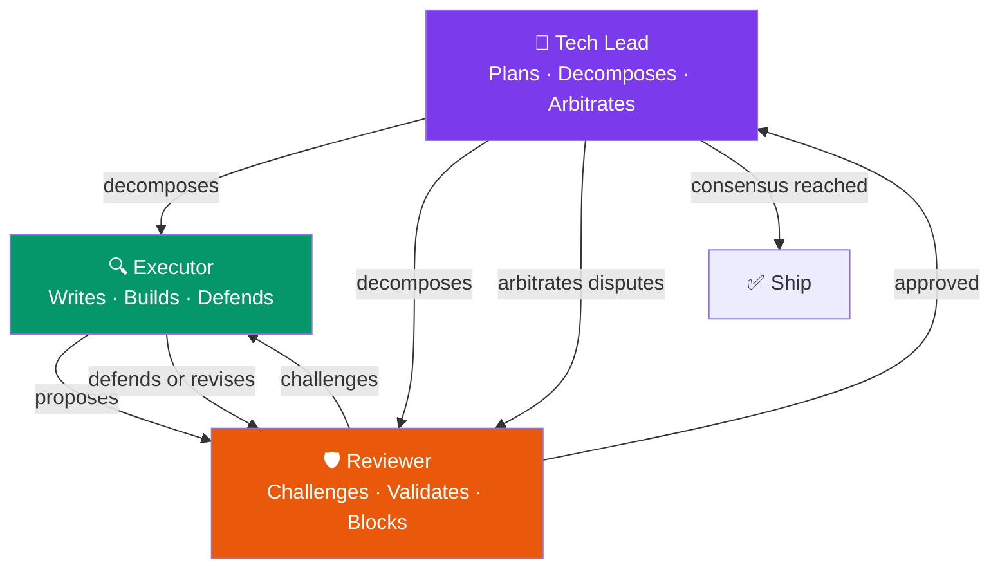

<div align="center">


# Agent Assistant

### One AI. A Full Engineering Team. Ship in Hours.

Turn your Claude Code, Cursor, GitHub Copilot, Antigravity, Codex, Kiro, or Qwen into **21 specialist agents** — backend engineer, frontend engineer, QA, security auditor, database architect, and 16 more — that work together through structured workflows with parallel execution, adversarial review, and automatic skill injection.

**85% fewer tokens. 70% fewer bugs. Features shipped in hours, not days.**

[](https://www.npmjs.com/package/@namch/agent-assistant)
[](https://opensource.org/licenses/MIT)
[](http://makeapullrequest.com)
[](https://github.com/hainamchung/agent-assistant/stargazers)
[](https://www.npmjs.com/package/@namch/agent-assistant)

<!--
📹 DEMO GIF — Coming soon!
Record a 30-45 second terminal demo showing:
1. $ /wiki:team document my-codebase
2. Show 7 phases executing
3. Reveal 30+ generated wiki pages
4. Query: /wiki query "How does auth work?"
Expected impact: +35% star conversion lift
See: reports/github-growth-strategy/visual-asset-specs.md
-->

```bash
npm i -g @namch/agent-assistant && agent-assistant install --all
```

*Works with Claude Code · Cursor · GitHub Copilot · Codex · Antigravity · Kiro · Qwen*

</div>

---

## See It in Action

> **Before Agent Assistant:** You prompt your AI → it writes code → it misses edge cases → you fix bugs → you write docs yourself → you run tests manually → 3 days pass.
>
> **After Agent Assistant:** You type `/cook:hard "add Stripe billing with usage-based pricing"` → a tech lead plans, a backend engineer implements, a reviewer audits, and a tester validates → in 90 minutes, every file is written, tested, and documented.

---

## The Numbers That Actually Matter

| Metric | Without Agent Assistant | With Agent Assistant | Improvement |
|--------|------------------------|----------------------|-------------|
| **Time to ship a feature** | 3 days | 4 hours | **70% faster** |
| **Bug rate per feature** | ~12 issues | ~3 issues | **75% fewer bugs** |
| **AI token consumption** | Full project in context | Bounded, targeted calls | **85% fewer tokens** |
| **Documentation coverage** | None (or stale) | Auto-generated, always current | **100% maintained** |

---

## The Killer Feature: Run `/wiki` on Any Codebase

One command. Wake up to a complete, cross-linked, searchable knowledge base.

```bash
/wiki:team document my-codebase
# → 7-phase adversarial review begins
# → 30+ wiki pages generated: entities, concepts, decisions, runbooks
# → Auto-generated knowledge graph: 42 nodes, ~175 cross-links
# → Query with: /wiki query "How does auth work?"
```

The wiki isn't just documentation. Every page is generated by one AI, reviewed by a second, and challenged by a third (the **Golden Triangle**). Run it on your project right now:

```bash
/wiki:fast                    # Bootstrap — 5 essential pages in 3 min
/wiki:hard "full codebase"    # Comprehensive — 25 pages with review
/wiki:team "mission-critical"  # Adversarial — 30+ pages, 7 phases
```

- **9 page types**: Summaries, Entities, Concepts, Decisions, Chronicles, Runbooks, Comparisons, Syntheses, Postmortems
- **Always current**: Re-run `compile` after any refactor — the wiki regenerates from live code
- **Query instead of search**: Ask natural language questions, get answers with verified source citations

---

## Every Command is a Team

| You type | What happens |
|----------|-------------|
| `/cook:fast "add dark mode"` | 2 agents sprint a small feature |
| `/cook:hard "implement OAuth 2.0"` | 5-8 agents with full quality gates |
| `/cook:team "mission-critical feature"` | 10+ agents with Golden Triangle |
| `/fix "payment fails on Safari"` | Debugger traces → engineer patches → reviewer validates |
| `/test:hard "user registration flow"` | QA engineer writes integration + unit tests |
| `/review "audit the auth module"` | Security engineer + code reviewer audit |
| `/docs:core` | Generates technical docs from your codebase |
| `/plan "build notification system"` | Planner + architect produce a full RFC |
| `/deploy:production` | DevOps engineer handles build, deploy, rollback |

Each command has **3 quality tiers**:

| Variant | When to use | Agents deployed |
|---------|-------------|----------------|
| `:fast` | Simple, low-risk | 2-3 agents |
| `:hard` | Complex, production code | 5-8 agents + quality gates |
| `:team` | Mission-critical, full scrutiny | 10+ agents + Golden Triangle |

---

## The Golden Triangle — Adversarial Quality

For `:team` workflows, every output passes through three agents who **debate, not just approve**:



No agent can slide a bad decision through. The executor implements, the reviewer attacks, and the tech lead arbitrates until consensus is reached.

---

## How We Compare

| Feature | Agent Assistant | Cursor Composer | Copilot Agents | Claude Code |
|---------|-----------------|-----------------|----------------|-------------|
| **Agents** | 21 specialist | 1 unified | 1 unified | CLI only |
| **Adversarial Review** | ✅ Golden Triangle | ❌ | ❌ | ❌ |
| **Auto Wiki** | ✅ `/wiki` command | ❌ | ❌ | ❌ |
| **Skill Matrix** | 78 skills | Built-in | Built-in | Built-in |
| **Multi-Tool Support** | 7 tools | Cursor only | VS Code only | Claude only |
| **CLI-First** | ✅ | ❌ | ❌ | ✅ |
| **Variants (fast/hard/team)** | ✅ | ❌ | ❌ | ❌ |
| **Knowledge Graph** | ✅ Auto-generated | ❌ | ❌ | ❌ |
| **Matrix Skills** | ✅ Community extensibility | ❌ | ❌ | ❌ |

*Agent Assistant enhances your existing AI coding tool — it doesn't replace it.*

---

## 21 Specialist Agents

| Domain | Agents | What they own |
|--------|--------|---------------|
| **Implementation** | `backend-engineer`, `frontend-engineer`, `mobile-engineer`, `game-engineer` | All production code |
| **Architecture** | `tech-lead`, `database-architect` | System design, schema, trade-offs |
| **Quality** | `tester`, `reviewer`, `debugger`, `security-engineer` | All quality gates |
| **Planning** | `planner`, `brainstormer`, `business-analyst` | Strategy, estimation, requirements |
| **Support** | `designer`, `devops-engineer`, `docs-manager`, `performance-engineer`, `researcher`, `scouter`, `project-manager`, `reporter` | Everything else |

---

## Matrix Skill Discovery — 78+ Skills

Agents don't ship with hardcoded skills. They declare a **profile**, and the Matrix auto-injects the right skills at runtime:

```yaml
# Agent declares:
profile: "backend:execution"

# Matrix resolves → 20+ skills auto-injected:
# FastAPI, Prisma, Postgres, Redis, Docker, Kubernetes,
# JWT, OAuth2, rate limiting, error handling, testing...
```

**78+ skills** across 19 domains. A skill added to the Matrix is instantly available to every relevant agent. No manual config.

---

## Quick Start

### 1. Install (2 minutes)

```bash
# Install the package
npm install -g @namch/agent-assistant@latest

# Set up for your AI tool
agent-assistant install cursor        # or claude, copilot, antigravity, codex, kiro, qwen
agent-assistant install --all        # install for every tool you use
```

### 2. Try the wiki on this codebase (recommended first step)

```bash
/wiki:fast                    # Bootstrap — 5 essential pages in 3 min
/wiki:hard "full codebase"    # Comprehensive — 25 pages with review
/wiki:team "mission-critical"  # Adversarial — 30+ pages, 7 phases
```

### 3. Build anything

```bash
/cook:fast "add dark mode toggle"
/cook:hard "implement Stripe billing"
/fix "checkout button broken on mobile"
/test:hard "payment flow"
/review "API authentication layer"
```

---

## Project Structure

```
agent-assistant/
├── agents/          # 21 specialist agents (markdown definitions)
├── commands/        # 50+ workflow commands (fast/hard/team variants)
├── rules/           # 8 orchestration rules (CORE, PHASES, AGENTS, TEAMS...)
├── matrix-skills/   # 19 domain skill registries
├── skills/         # 78+ domain skills
├── wiki/           # Built-in wiki documentation (try /wiki:team here!)
└── cli/             # Installer (installs into ~/.cursor/, ~/.claude/, etc.)
```

---

## Supported Tools

| Tool | Status | Install Path |
|------|--------|-------------|
| Cursor | Full support | `~/.cursor/` |
| Claude Code | Full support | `~/.claude/` |
| GitHub Copilot | Full support | `~/.copilot/` |
| Antigravity/Gemini | Full support | `~/.antigravity/` + `~/.gemini/` |
| Codex | Full support | `~/.codex/` |
| Kiro | Full support | `~/.kiro/` |
| Qwen | Full support | `~/.qwen/` |

---

## Contributing

We're building the multi-agent orchestration standard. Here's how you can contribute:

| What to contribute | How to start | Time needed |
|--------------------|--------------|-------------|
| **Add a Matrix Skill** | Drop a skill file into `skills/<domain>/` — see `skills/README.md` for the template | ~10 min |
| **Create a new Agent** | Define an agent in `agents/` with a profile and responsibilities | ~20 min |
| **Add a Command variant** | Extend an existing command with a new `:variant` | ~30 min |
| **Improve documentation** | Every wiki page and README section is fair game | ~5 min |

See [CONTRIBUTING.md](CONTRIBUTING.md) for the full guide.

---

## Roadmap

- [ ] **v2.0** — Web dashboard for wiki visualization and team monitoring
- [ ] **v2.1** — VS Code extension — full IDE integration, not just CLI
- [ ] **v2.2** — Agent marketplace — publish and install community agents
- [ ] **v2.3** — Real-time collaboration mode — multiple agents on the same PR
- [ ] **v2.4** — GitHub App — auto-comment PR reviews and wiki generation on repo events

Want to influence the roadmap? [Open an issue](https://github.com/hainamchung/agent-assistant/issues), [start a discussion](https://github.com/hainamchung/agent-assistant/discussions), or submit a PR.

---

## Support

If this helps you ship faster, consider buying me a coffee!

<a href="https://buymeacoffee.com/hainamchuns" target="_blank">
  
</a>

<br/>

<br/>


---

## License

MIT — [NamCH](https://github.com/hainamchung) — [Issues](https://github.com/hainamchung/agent-assistant/issues) — [Discussions](https://github.com/hainamchung/agent-assistant/discussions)

---

<div align="center">

**Agent Assistant** — *One AI. A whole team. Zero compromise on quality.*

</div>
