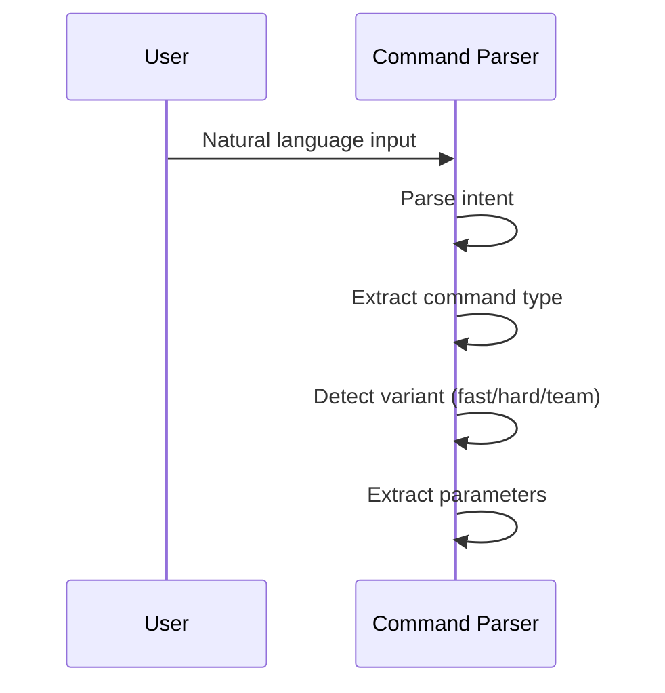
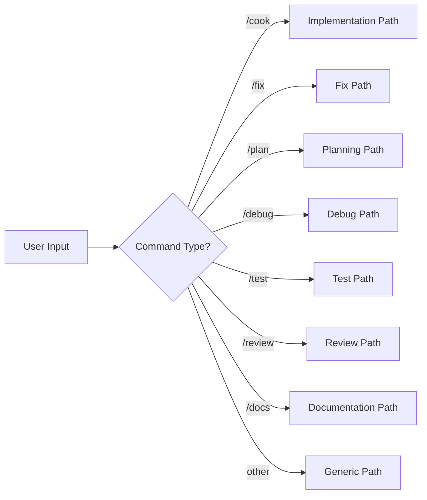
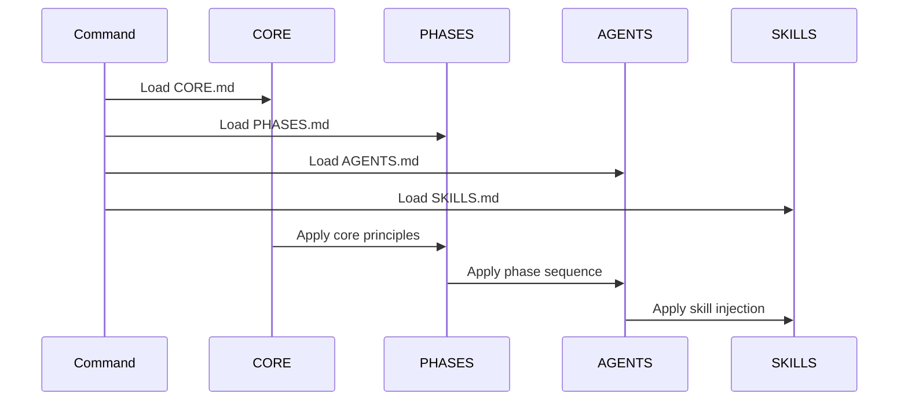
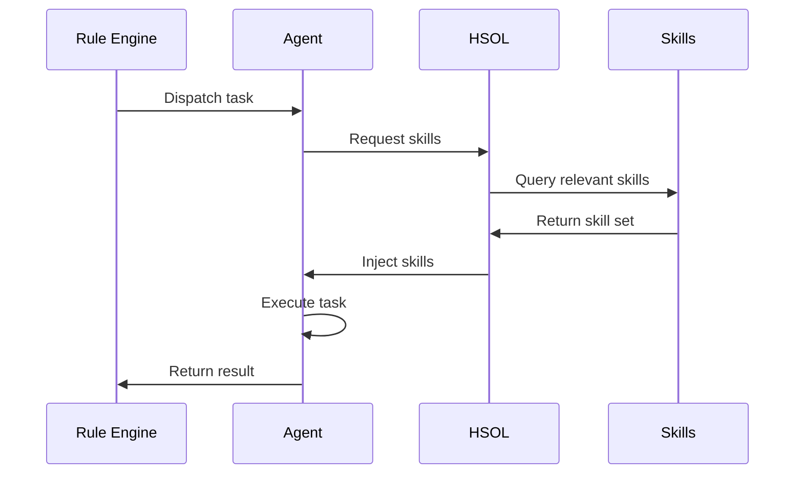
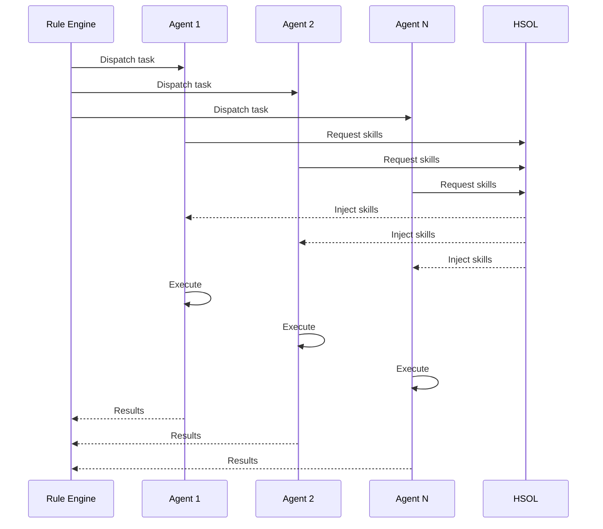
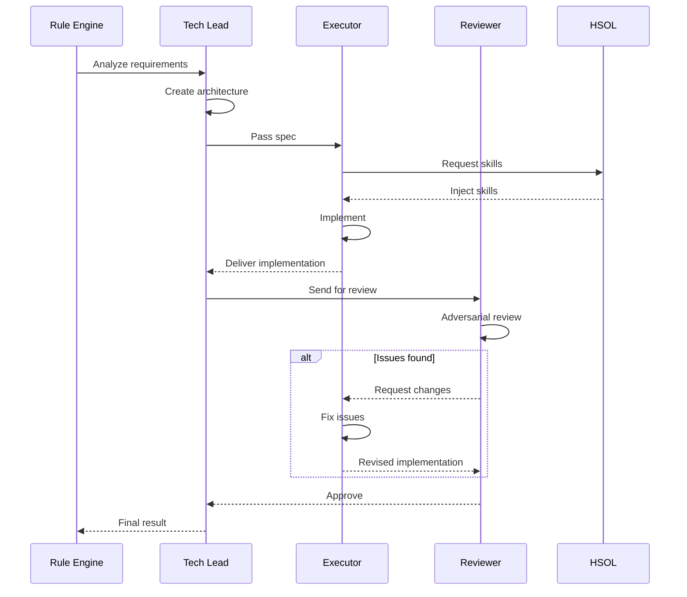
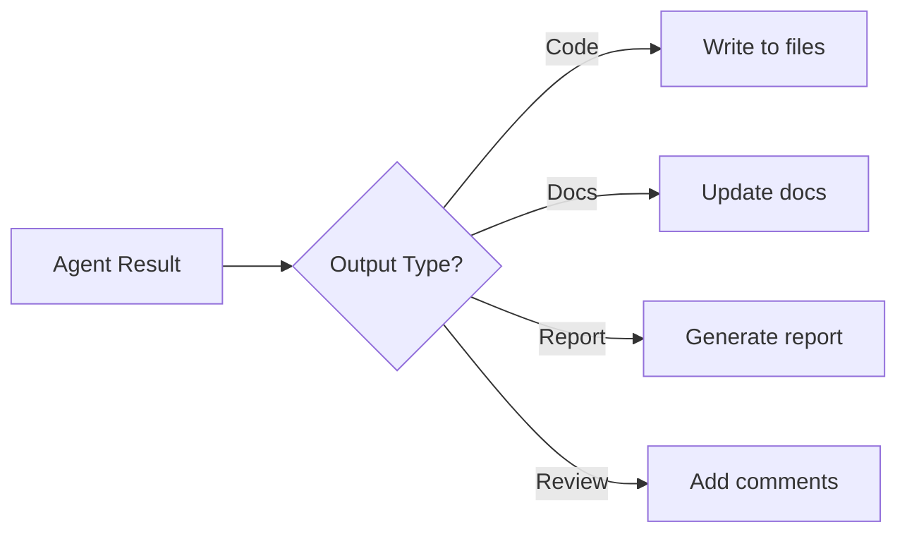
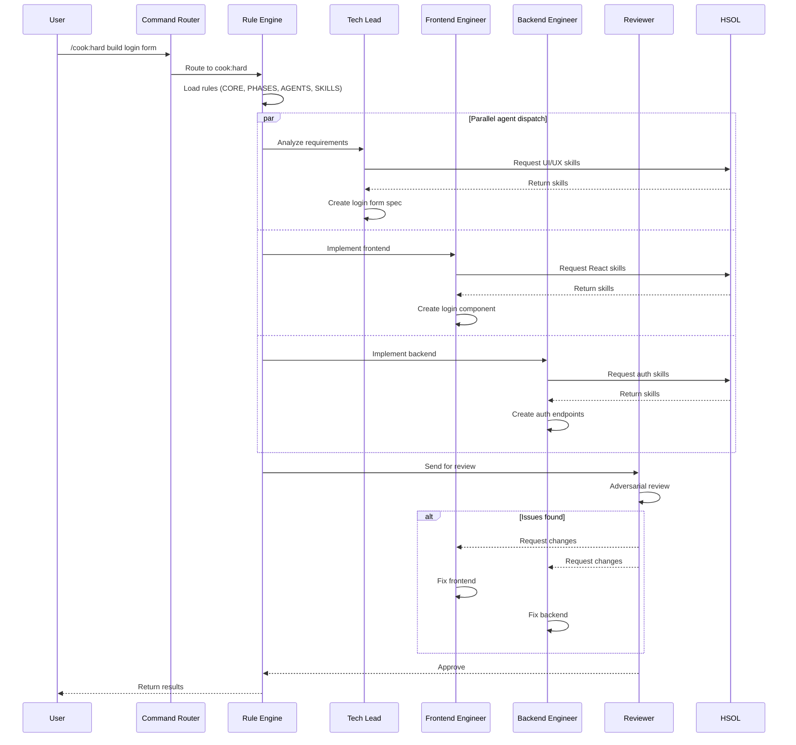
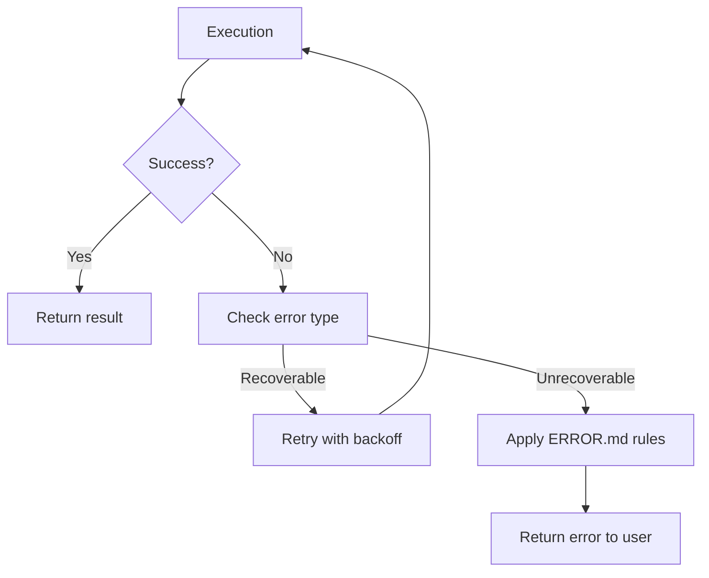

# Data Flow

> **File**: `documents/knowledge-architecture/03-data-flow.md`
> **Purpose**: Request lifecycle from user input to agent output

---

## Overview

Agent Assistant processes user requests through a five-stage pipeline:

```
User Input → Command Routing → Rule Application → Agent Execution → Output
```

This document traces the complete lifecycle of a request through the system.

---

## Stage 1: User Input

### Input Sources

| Source | Format | Example |
|--------|--------|---------|
| Terminal | Text command | `/cook`, `/fix`, `/plan` |
| Chat | Natural language | "Build a login form" |
| IDE | Inline command | `/fix bug in auth` |

### Input Processing



### Input Fields

| Field | Type | Description |
|-------|------|-------------|
| `command` | string | Primary command (e.g., `/cook`) |
| `variant` | enum | `fast`, `hard`, `team` |
| `params` | object | Command-specific parameters |
| `context` | object | Current file, project state |

---

## Stage 2: Command Routing

### Routing Logic



### Variant Selection

| Variant | Trigger | Agents | Gating |
|---------|---------|--------|--------|
| fast | Default, `/cmd` | 2-3 | Basic review |
| hard | `/cmd:hard` | 5-8 | Full quality gates |
| team | `/cmd:team` | Golden Triangle | Adversarial review |

### Routing Rules

1. **Parse command** — Extract base command from `/command:variant`
2. **Load rules** — Read corresponding command file from `commands/`
3. **Select agents** — Determine agents based on variant
4. **Inject context** — Add project context, file state

---

## Stage 3: Rule Application

### Rule Loading Sequence



### Rule Application Order

| Order | Rule | Purpose |
|-------|------|---------|
| 1 | `CORE.md` | Core principles and constraints |
| 2 | `PHASES.md` | Phase definitions and transitions |
| 3 | `AGENTS.md` | Agent selection and roles |
| 4 | `SKILLS.md` | Skill injection configuration |
| 5 | `TEAMS.md` | Team coordination (if team variant) |

### Rule Variables

| Variable | Source | Available In |
|----------|--------|--------------|
| `{{COMMAND}}` | Command layer | Rules, agents |
| `{{VARIANT}}` | Command layer | Rules, agents |
| `{{AGENT}}` | Agent layer | Rules, agents |
| `{{SKILLS}}` | Skill layer | Agents |

---

## Stage 4: Agent Execution

### Single Agent Flow (Fast Variant)



### Multi-Agent Flow (Hard Variant)



### Golden Triangle Flow (Team Variant)



---

## Stage 5: Output

### Output Types

| Type | Format | Example |
|------|--------|---------|
| Code | Files, patches | New component files |
| Documentation | Markdown | API docs |
| Report | Structured data | Bug analysis |
| Review | Comments | Code review notes |

### Output Flow



---

## Complete Request Lifecycle

### Example: `/cook:hard build login form`



---

## Error Handling

### Error Flow



### Error Types

| Type | Behavior | Example |
|------|----------|---------|
| Agent failure | Retry 3x, then fail | Agent crash |
| Skill missing | Fallback to generic | Unknown domain |
| Path error | Use default paths | Invalid platform path |

---

## Evidence Sources

- `rules/CORE.md` — Core orchestration rules
- `rules/PHASES.md` — Phase definitions
- `rules/AGENTS.md` — Agent orchestration
- `rules/SKILLS.md` — Skill injection
- `rules/TEAMS.md` — Team coordination
- `commands/` — Command definitions
- `agents/` — Agent implementations
