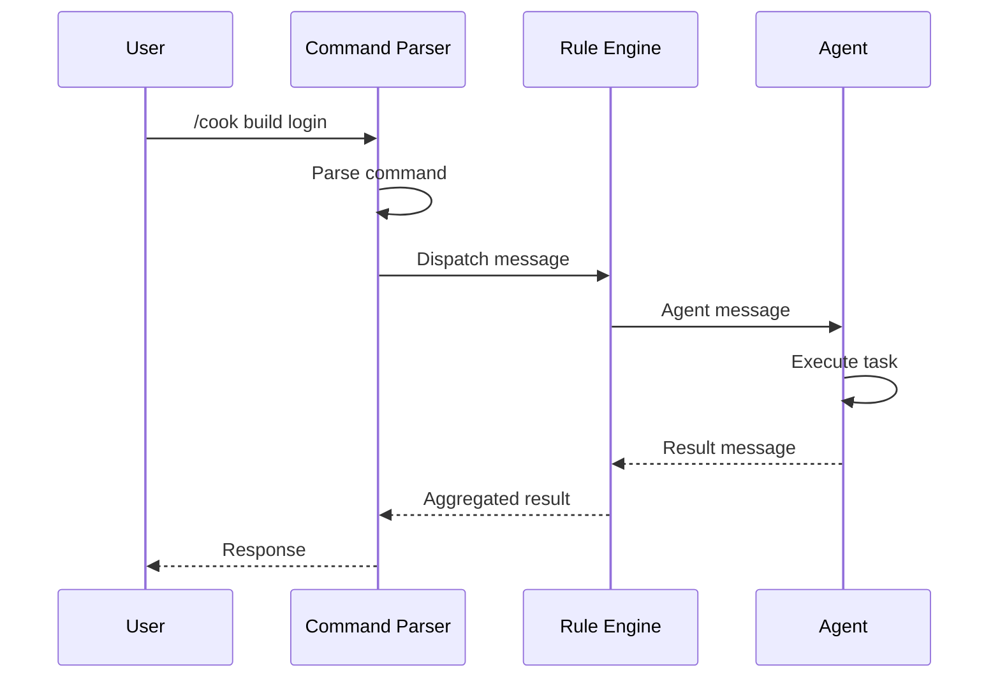

# API Contracts

> **File**: `documents/knowledge-domain/03-api-contracts.md`

---

## Status: Not Applicable

**Not applicable** — Agent Assistant is a CLI tool, not a REST API. There are no HTTP endpoints, request/response bodies, or REST conventions.

---

## Rationale

Agent Assistant is designed as a **local CLI framework** that orchestrates AI agents within the user's IDE. It does not expose network APIs.

### Design Philosophy

| Principle | Implementation |
|-----------|-----------------|
| **Local-first** | All execution happens locally |
| **No server** | No background service required |
| **No network** | No external API dependencies |
| **IDE integration** | Works within existing AI coding tools |

---

## Interface Model

Instead of REST APIs, Agent Assistant uses a **command-based interface**:

### Command Interface

| Component | Format | Example |
|-----------|--------|---------|
| **Command** | Slash prefix | `/cook`, `/fix` |
| **Variant** | Colon suffix | `:fast`, `:hard`, `:team` |
| **Parameters** | Natural language | `/cook build login form` |

### Command Examples

```bash
# Fast variant (2-3 agents)
/cook build login form

# Hard variant (5-8 agents)
/cook:hard implement user authentication

# Team variant (Golden Triangle)
/build:team enterprise payment system
```

---

## Entry Points

### CLI Entry Point

| File | Purpose |
|------|---------|
| `cli/install.js` | Main CLI installer (1716 lines) |

### Web Entry Point

| File | Purpose |
|------|---------|
| `web/src/main.tsx` | React application entry |
| `web/src/pages/` | Page components |

### Command Loading

Commands are loaded from `commands/` folder:

```
commands/
├── cook.md
├── cook/
│   ├── fast.md
│   ├── hard.md
│   └── team.md
├── fix.md
└── ...
```

---

## Alternative: Internal Protocol

For internal communication between components, Agent Assistant uses **message passing**:

### Message Format

```typescript
interface Message {
  type: 'command' | 'agent' | 'skill' | 'team';
  action: string;
  payload: object;
  context: {
    command: string;
    variant: 'fast' | 'hard' | 'team';
    agents: string[];
  };
}
```

### Message Flow



---

## Future API Considerations

| Consideration | Status | Notes |
|---------------|--------|-------|
| REST API for CLI control | Pending | Optional remote control |
| WebSocket for real-time | Pending | Future collaboration |
| GraphQL for queries | Pending | If database added |

---

## Evidence Sources

- `cli/install.js` — CLI implementation
- `commands/` — Command definitions
- `web/src/main.tsx` — Web application entry
- `web/src/pages/` — Web page components
- `rules/CORE.md` — Core orchestration
