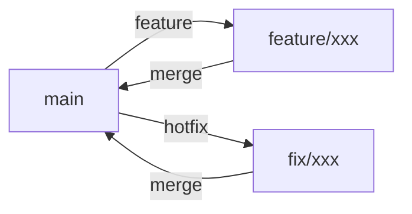
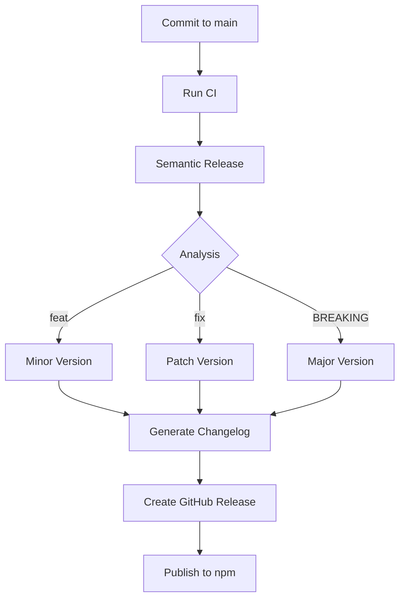

# Git Workflow

> **File**: `documents/knowledge-standards/03-git-workflow.md`
> **Purpose**: Conventional commits, semantic-release, .releaserc.json, CHANGELOG.md

---

## Overview

Agent Assistant uses Semantic Release with Conventional Commits for automated versioning and changelog generation.

---

## Branch Strategy

### Branch Names

| Branch | Purpose | Protection |
|--------|---------|------------|
| `main` | Production code | Required reviews |
| `develop` | Development (optional) | Required reviews |
| `feature/*` | Feature branches | Flexible |
| `fix/*` | Bug fix branches | Flexible |
| `docs/*` | Documentation branches | Flexible |

### Branch Lifecycle



---

## Commit Message Format

### Structure

```
{type}({scope}): {description}

[optional body]

[optional footer]
```

### Components

| Component | Required | Description |
|-----------|----------|-------------|
| type | Yes | Commit type |
| scope | No | Affected module |
| description | Yes | Brief summary |
| body | No | Detailed description |
| footer | No | Breaking changes, issues |

---

## Commit Types

### Types Table

| Type | Description | Included in Changelog |
|------|------------|----------------------|
| feat | New feature | Yes |
| fix | Bug fix | Yes |
| docs | Documentation | Yes |
| style | Formatting | No |
| refactor | Code restructuring | No |
| perf | Performance | Yes |
| test | Adding tests | No |
| chore | Maintenance | No |
| build | Build system | No |
| ci | CI/CD | No |
| revert | Revert change | No |

---

## Commit Examples

### Feature Commit

```
feat(commands): add wiki command with fast/hard/team variants

Add the /wiki command for generating project documentation.
Supports three variants for different complexity levels.

Closes #123
```

### Bug Fix Commit

```
fix(agents): correct backend-engineer skill list

Remove deprecated 'express' from required skills.
Add 'fastify' as preferred alternative.

Closes #456
```

### Documentation Commit

```
docs(rules): update AGENTS.md with new agents

Add entries for wiki-architect and wiki-extractor agents.
Update skill requirements.

Closes #789
```

### Refactor Commit

```
refactor(cli): simplify path replacement logic

Extract path replacement into separate function.
Reduce cognitive complexity from 15 to 8.

BREAKING CHANGE: Path replacement syntax changed
```

---

## Semantic Release

### Configuration

`.releaserc.json`:

```json
{
  "branches": ["main", "master"],
  "plugins": [
    "@semantic-release/commit-analyzer",
    "@semantic-release/release-notes-generator",
    "@semantic-release/changelog",
    "@semantic-release/github",
    "@semantic-release/npm"
  ],
  "preset": "conventionalcommits"
}
```

### Release Process



### Version Calculation

| Commit Type | Version Increment | Example |
|-------------|------------------|---------|
| feat | Minor (x.**Y**.z) | 1.**2**.3 → 1.3.0 |
| fix | Patch (x.y.**Z**) | 1.2.**3** → 1.2.4 |
| feat + BREAKING | Major (**X**.y.z) | **1**.2.3 → 2.0.0 |
| docs (with feat) | Minor | Combined |
| docs (only) | None | Not released |

---

## CHANGELOG.md

### Format

```markdown
# Changelog

All notable changes to this project will be documented in this file.

The format is based on [Keep a Changelog](https://keepachangelog.com/en/1.0.0/),
and this project adheres to [Semantic Versioning](https://semver.org/spec/v2.0.0.html).

## [2.0.0] - 2024-01-15

### Features

- `feat(commands)`: add wiki command

### Breaking Changes

- `BREAKING CHANGE`: old API removed

## [1.0.0] - 2024-01-01

### Features

- Initial release
```

### Sections

| Section | Content |
|---------|---------|
| Added | New features |
| Changed | Changes in existing functionality |
| Deprecated | Soon-to-be removed features |
| Removed | Removed features |
| Fixed | Bug fixes |
| Security | Vulnerability fixes |

---

## Git Hooks (Husky)

### Configuration

Husky v8 is used for Git hooks.

### Pre-Commit Hook

```bash
# .husky/pre-commit
npm test
npm run lint
```

### Commit-Msg Hook

Validates commit message format:

```bash
# .husky/commit-msg
npx --no -- commitlint --edit ${1}
```

---

## Workflow Examples

### Feature Development

```bash
# 1. Create feature branch
git checkout -b feature/new-command

# 2. Make changes
git add .
git commit -m "feat(commands): add new command"

# 3. Push branch
git push -u origin feature/new-command

# 4. Create PR (triggers release on merge)
```

### Bug Fix

```bash
# 1. Create fix branch
git checkout -b fix/agent-skill-error

# 2. Make changes
git add .
git commit -m "fix(agents): correct skill validation"

# 3. Push and PR
git push origin fix/agent-skill-error
```

### Hotfix

```bash
# 1. Create hotfix from main
git checkout main
git pull
git checkout -b fix/critical-security

# 2. Make urgent changes
git add .
git commit -m "fix!: critical security patch"

# 3. Merge (triggers patch release)
git checkout main
git merge --no-ff fix/critical-security
git push
```

---

## Pull Request Guidelines

### PR Title

Use conventional commit format:

```
feat(commands): add wiki command
fix(cli): correct path resolution
docs(rules): update AGENTS.md
```

### PR Description

```markdown
## Summary
Brief description of changes.

## Changes
- Change 1
- Change 2

## Testing
How was this tested?

## Checklist
- [ ] Tests added
- [ ] Documentation updated
- [ ] No breaking changes (or documented)
```

---

## Evidence Sources

- `.releaserc.json` — Release configuration
- `package.json` — NPM scripts
- `CHANGELOG.md` — Changelog example
- Git hooks in `.husky/` — Husky configuration
